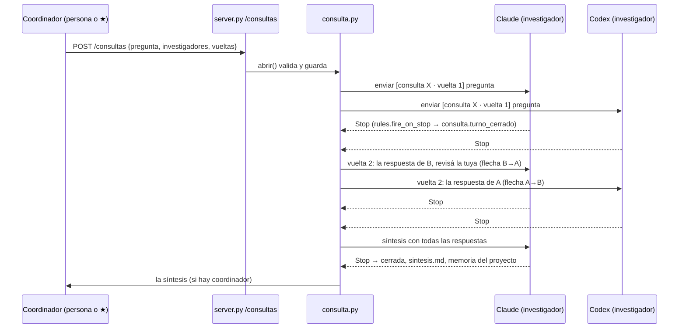

# Diseño: consulta entre investigadores

## Resumen

Un módulo nuevo, `lienzo/consulta.py`, guarda las consultas y las hace avanzar: escucha el cierre de
turno de cada tarjeta (el mismo gancho que dispara las reglas `on_stop`), y cuando todos los
investigadores de una vuelta contestaron arma la vuelta siguiente, la síntesis o el cierre. Los
mensajes van por el envío de siempre (`send`, con adjunto si es largo) y dejan flecha con un `kind`
nuevo, `consulta`; el tablero dibuja esas flechas, las tarjetas que participan y su grupo con un estilo
propio, y abre la consulta en una vista con las vueltas lado a lado.

## Arquitectura



Ninguna tarjeta le escribe a otra: todo envío sale de `consulta.py`, que lleva la cuenta de vueltas.
Eso es lo que hace imposible el bucle A↔B (2.3).

## Componentes e interfaces

### `lienzo/consulta.py` (nuevo: el motor)

```python
VUELTAS_DEFECTO, VUELTAS_MAX = 2, 3
ESPERA_DEFECTO_MIN = 30
SIN_CAMBIOS = "SIN CAMBIOS"

def cargar() -> None                     # al arrancar: lee ~/.lienzo/consultas/*/consulta.json
def abrir(d: dict, coordinador: str | None) -> tuple[int, dict]     # valida (1.2, 1.3), guarda, envía la vuelta 1
def turno_cerrado(s: dict) -> None       # gancho: una tarjeta cerró turno; si es respuesta de una consulta, avanza
def vigilar() -> None                    # cada barrido: muertas, detenidas, vencidas (3.4)
def cancelar(cid: str) -> tuple[int, dict]
def listar(limite: int = 20) -> list[dict]           # resumen: id, pregunta, estado, vuelta, quién falta
def ver(cid: str) -> dict | None                      # entera, con las respuestas (2.4)
def de_tarjeta(sid: str) -> dict | None               # la consulta abierta de esa tarjeta (para la marca de la tarjeta)
enviar = None   # lo cablea server.py al arrancar: enviar(sid, texto, de) -> (code, out), el envío de siempre
```

- **Estado** en memoria (`CONSULTAS: dict[str, dict]`) protegido por `state.lock`, y en disco en
  `~/.lienzo/consultas/<id>/consulta.json` con `atomic_write` en cada cambio. Las respuestas, además,
  como `v<n>-<sid8>.md` y la síntesis como `sintesis.md`, para leerlas sin el lienzo.
- **Qué cuenta como respuesta (2.6):** cada envío de la consulta empieza con una marca
  `[consulta <id> · vuelta <n>]` (o `· síntesis`, `· revisión`). Al cerrar turno, la tarjeta cuenta como
  respuesta si tiene un envío pendiente de la consulta, cerró turno después de ese envío
  (`state_since` posterior a `enviado`), y su último pedido es el de la consulta: `last_prompt` empieza
  con la marca, o es la línea «Leé el archivo adjunto…» que apunta a un `mensaje.md` cuyo contenido
  empieza con la marca. Lo segundo hace falta porque el hook `UserPromptSubmit` pisa `last_prompt` con
  lo que se tecleó de verdad, y un mensaje largo se teclea como esa línea. Lo que la persona escriba por
  la caja no lleva la marca: no cuenta. El texto es `rules.full_reply(s)` sin el recorte a 6000.
- **Avance:** con todas las respuestas de la vuelta N: si todas empiezan con `SIN CAMBIOS` (y N > 1)
  o N es la última, pasa a `sintetizando` y le manda al sintetizador la pregunta y todas las respuestas;
  si no, le manda a cada investigador las de los otros de la vuelta N y pasa a N+1. Con la síntesis:
  `cerrada`, `sintesis.md`, captura en la memoria y envío al coordinador.
- **Nombres (aclaración 3):** «Claude (opus)», «Codex (gpt-5.4)»: `agentes.perfil(s["agent"])` más
  `s["model"]` acortado. Si dos investigadores comparten nombre, se les suma la letra (A, B, C).
- **El pedido de cada vuelta** (plantillas en el módulo, en castellano): la pregunta; que pueden leer
  el repo y buscar en la web pero no editar archivos (aclaración 5); y desde la vuelta 2, las respuestas
  de los otros con el pedido de decir qué aceptan, qué refutan y su respuesta corregida, o
  `SIN CAMBIOS` en la primera línea si la mantienen. La síntesis pide acuerdos, desacuerdos (quién
  sostiene qué) y la conclusión recomendada.
- **Envíos en paralelo:** los de una vuelta salen con `fan_out` (un investigador de otra PC no frena a
  los demás). Un envío que falla (409, 404 `gone`, 503) saca a ese investigador si quedan dos o más, o
  cancela (3.4), con el motivo en la consulta.
- **Flechas:** el envío lleva `from` = el investigador cuya respuesta se pasa (el coordinador en la
  vuelta 1 y en la entrega final) y la flecha se guarda con `kind: "consulta"` y `consulta: <id>`. Con
  dos respuestas para un mismo destino (tres investigadores) se dibujan las dos flechas.
- **Vigilancia (3.4):** `vigilar()` corre desde el lazo de vivencia que ya existe (cada pocos
  segundos, se limita a cada 30 s): investigador muerto, detenido, o sin cerrar turno pasados `espera`
  minutos desde su envío → se lo saca o se cancela, y se avisa al coordinador.
- **Dos caminos para enterarse de una respuesta:** el gancho `turno_cerrado` es el rápido, pero solo
  corre en la PC dueña de la tarjeta. Para un investigador de otra PC (6.3), o una respuesta que llegó
  con el server caído (2.5), `vigilar()` mira cada 30 s las tarjetas con envío pendiente (locales y
  espejadas): si están en `termino` con el último pedido de la consulta (misma regla de arriba), toma
  la respuesta de la transcripción espejada. Las dos vías pasan por la misma función, que es
  idempotente: una respuesta ya guardada no se guarda dos veces.

### Calidad de la discusión (lo que hace que valga la pena)

Dos modelos que se leen tienden a darse la razón; una consulta que converge por cortesía no sirve. El
diseño lo compensa en los pedidos, no con más vueltas:

- **Vuelta 1 independiente:** los envíos salen a la vez y nadie ve nada de los otros hasta la vuelta 2.
- **Revisar con evidencia:** desde la vuelta 2 el pedido exige separar «acepto (y por qué)», «sostengo
  (y por qué)» y «refuto (con evidencia: código, fuente o contraejemplo)», y prohíbe cambiar de
  posición sin una razón nueva. Cada respuesta cierra con una línea `Confianza: alta|media|baja`.
- **Enfoque opcional por investigador** (`enfoques`, p. ej. «buscá por qué esto falla», «pensalo desde
  la operación»): diversidad deliberada cuando la pregunta lo amerita. Sin enfoque, todos contestan la
  misma pregunta.
- **Síntesis honesta:** el sintetizador también participó, así que tiene sesgo. Se le pide atribuir cada
  postura a quien la sostiene y separar acuerdos de desacuerdos sin resolverlos a su favor; y después
  hay una **revisión breve**: cada uno de los otros recibe la síntesis y contesta en una línea
  `REPRESENTA BIEN` o su corrección. Las correcciones se agregan a `sintesis.md` como «Objeciones». Es
  un turno corto por investigador, y se puede apagar con `revisar_sintesis: false`.
- **Tope de costo:** con 3 investigadores y 3 vueltas son a lo sumo 9 turnos de discusión, 1 de síntesis
  y 2 de revisión. `POST /consultas` devuelve ese tope para que el coordinador lo vea antes.

### `lienzo/rules.py` (gancho)

`fire_on_stop` llama `consulta.turno_cerrado(cerrada)` después de `captura.respuesta(cerrada)`, dentro
de un `try` que deja la traza en el log sin cortar las reglas del usuario. Así hereda la espera de
coda (`ON_STOP_SETTLE_S`): un Stop intermedio no cuenta como respuesta.

`add_link(src, dst, text, kind, consulta=None)`: el campo `consulta` se guarda solo si viene.

### `lienzo/server.py` (rutas y cableado)

```
POST /consultas                 {pregunta, investigadores, vueltas?, sintetizador?, espera_min?, coordinador?, enfoques?, revisar_sintesis?}
                                → {id, tope_turnos}
GET  /consultas                 resumen de las últimas 20
GET  /consultas/<id>            entera
POST /consultas/<id>/cancelar
```

Con `_authed()` y `X-Lienzo` como el resto de las escrituras. Al arrancar: `consulta.enviar =` una
función que hace lo mismo que `POST /sessions/<sid>/send` del tablero (local o reenviado a la PC
dueña, con `from` para la flecha) y marca la flecha como de la consulta; `consulta.cargar()`. Cada
cambio de una consulta sale por SSE como `{"type": "consulta", "consulta": <resumen>}`.

### `skills/lienzo/coordinar.py`

```python
def consulta(pregunta, investigadores, vueltas=2, sintetizador=None, espera_min=30) -> str   # id; coordinador = YO
def consulta_estado(cid) -> dict
```

Y una sección «Consulta entre investigadores» en `skills/lienzo/SKILL.md` (5.2).

### Web

- `types.ts`: `Consulta` (resumen y entera) y `Link.kind` suma `"consulta"`.
- `api.ts`: `getConsultas`, `getConsulta`, `cancelConsulta`; el SSE de `consulta` actualiza un estado
  `consultas` en `App`.
- **Card** (4.1): si la tarjeta está en una consulta abierta, clase `investigador` (color e ícono
  propios, tokens nuevos `--investigador*` en `:root` y en el tema oscuro) y una línea «vuelta 2 de 3 ·
  esperando a Codex» en lugar del estado.
- **Board** (4.2): las tarjetas de una consulta abierta se dibujan juntas dentro de un marco con la
  pregunta como título; tocar el título abre la vista.
- **Arrows** (4.2): `kind === "consulta"` con trazo propio (punteado, color de investigador) y su
  nombre en la leyenda («consulta»).
- **`Consulta.tsx`** (nuevo, 4.3): una columna por investigador, una fila por vuelta, respuestas
  enteras con el mismo render de Markdown que la conversación; la síntesis al pie; botón Cancelar si
  está abierta.
- **Menú ⋯ → «Consultas»** (4.4): las últimas, cerradas incluidas, que abren la misma vista.

## Modelo de datos

```json
{
  "id": "c-20261010-1a2b3c",
  "pregunta": "…",
  "investigadores": ["<sid A>", "<sid B>"],
  "nombres": {"<sid A>": "Claude (opus)", "<sid B>": "Codex (gpt-5.4)"},
  "sintetizador": "<sid A>",
  "coordinador": "<sid de la ★> | null",
  "vueltas": 2,
  "espera_min": 30,
  "enfoques": {"<sid B>": "buscá por qué esto falla"},
  "revisar_sintesis": true,
  "estado": "abierta | sintetizando | revisando | cerrada | cancelada",
  "vuelta": 1,
  "pendientes": {"<sid>": {"marca": "[consulta c-… · vuelta 1]", "enviado": "<iso>"}},
  "respuestas": {"1": {"<sid A>": {"texto": "…", "ts": "<iso>", "agente": "claude", "modelo": "opus"}}},
  "sintesis": null,
  "objeciones": {"<sid B>": "REPRESENTA BIEN | <corrección>"},
  "fuera": {"<sid>": "murió en la vuelta 2"},
  "motivo": null,
  "creada": "<iso>",
  "cerrada": null
}
```

## Manejo de errores

| Caso | Comportamiento |
|---|---|
| Pedido inválido (1.2) | 400 con el motivo; nada se envía ni se guarda |
| Investigador corriendo al abrir (1.3) | 409 |
| Envío de una vuelta falla | ese investigador sale (`fuera`) si quedan ≥ 2; si no, `cancelada` con el motivo |
| Investigador muere, se detiene o vence la espera (3.4) | igual que arriba, desde `vigilar()`; aviso al coordinador |
| El sintetizador sale | la síntesis pasa al siguiente investigador que quede |
| `consulta.json` corrupto | `state.apartar_corrupto` y se sigue con las demás (mismo trato que `rules.json`) |
| Excepción en `turno_cerrado` | traza en el log; las reglas del usuario del mismo Stop se disparan igual |
| La persona escribe por la caja | no lleva la marca: no cuenta como respuesta (2.6) |

## Decisiones

- **Gancho en `fire_on_stop` y no una regla `on_stop` por investigador:** una regla escribe un texto
  fijo a un destino; la consulta necesita juntar respuestas de varios y decidir. Y así no aparecen
  reglas A↔B (2.3).
- **Marca en el texto para saber qué turno es respuesta:** el lienzo no tiene un id de pedido común a
  los cuatro agentes; `last_prompt` sí, y la marca hace que lo de la caja no se confunda (2.6).
- **Guardar en `~/.lienzo/consultas/` y no en la base de conocimiento:** la consulta es estado vivo con
  vueltas; a la memoria va lo que vale después, la síntesis (3.3).
- **Mismo canal, otro aspecto** (pedido de Ariel): nada escondido; lo distinto es el `kind` de la
  flecha y el estilo de tarjetas y grupo.

## Estrategia de prueba

`tests/test_consulta.py`, con `consulta.enviar` falso que anota los envíos y tarjetas armadas en
`state.sessions`:

| Requisito | Prueba |
|---|---|
| 1.1 | abrir con dos: 200, id, un envío por investigador con la marca de la vuelta 1, guardada en disco |
| 1.2 | uno, cuatro, repetido, desconocido, detenido, ya en otra consulta: 400 sin envíos |
| 1.3 | uno corriendo: 409 sin envíos |
| 2.1 / 2.6 | cierre de turno con la marca guarda la respuesta; sin la marca (escrito por la caja) no |
| 2.2 / 2.3 | con las dos respuestas, cada uno recibe la del otro con `from` del otro; no se crea ninguna regla |
| 2.4 | `GET /consultas/<id>` devuelve vueltas y respuestas (ruta en `tests/test_consulta_api.py`) |
| 2.5 | recargar desde disco una abierta y seguir; respuesta llegada con el server caído se toma en `vigilar()` |
| 3.1 | `SIN CAMBIOS` de todos en la vuelta 2 de 3 → sintetizando sin vuelta 3 |
| 3.2 / 3.3 | tope → síntesis al sintetizador; revisión de los otros; cierra con `sintesis.md` (con objeciones), captura y envío al coordinador; con `revisar_sintesis: false` cierra sin revisión |
| marca | respuesta con mensaje largo: `last_prompt` es «Leé el archivo adjunto…» y el `mensaje.md` empieza con la marca → cuenta; un pedido de la caja después del envío → no |
| 6.3 | investigador espejado de otra PC: `vigilar()` toma su respuesta de la tarjeta espejada; la misma respuesta por las dos vías se guarda una vez |
| calidad | el pedido de la vuelta 2 trae las respuestas de los otros con nombre, las tres secciones y la línea de confianza; un enfoque llega solo a su investigador |
| 3.4 | muere uno de tres → sigue con dos; muere uno de dos → cancelada y aviso; espera vencida igual |
| 3.5 | cancelar no envía más y conserva lo respondido |
| 4.1–4.4 | recorrido de la web con fixtures (Playwright, como los de `pruebas-agenticas`): tarjeta con estilo de investigador y vuelta, grupo con la pregunta, flecha de consulta, vista lado a lado, lista en el menú |
| 5.1 | `coordinar.consulta` arma el pedido con `YO` como coordinador (`tests/test_coordinar.py`) |
| 6.2 | la batería completa pasa sin cambios |

Prueba en vivo al cerrar: una consulta real entre un Claude y un Codex de esta PC con una pregunta
corta, dos vueltas, y la síntesis en la memoria.
