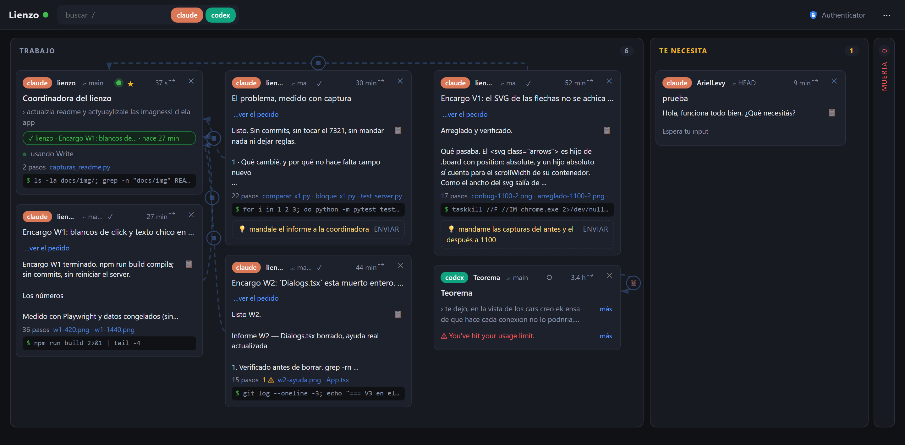
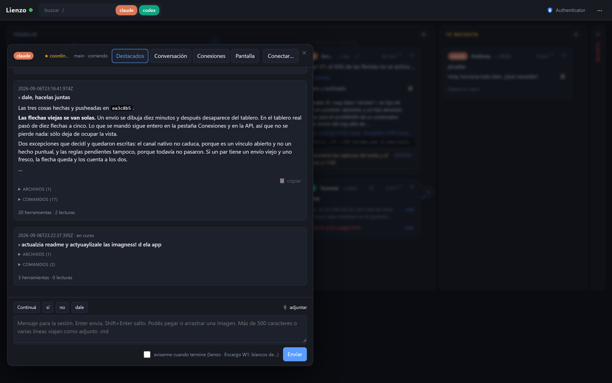
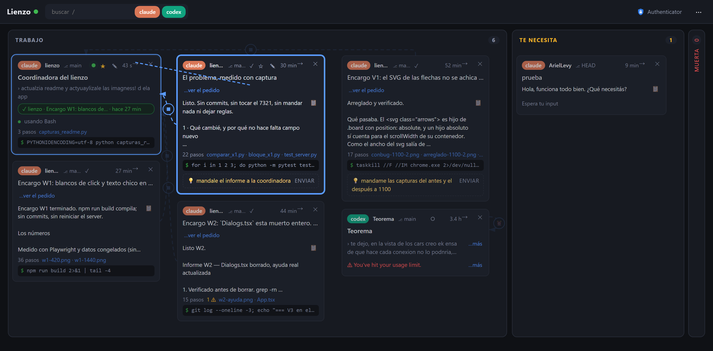
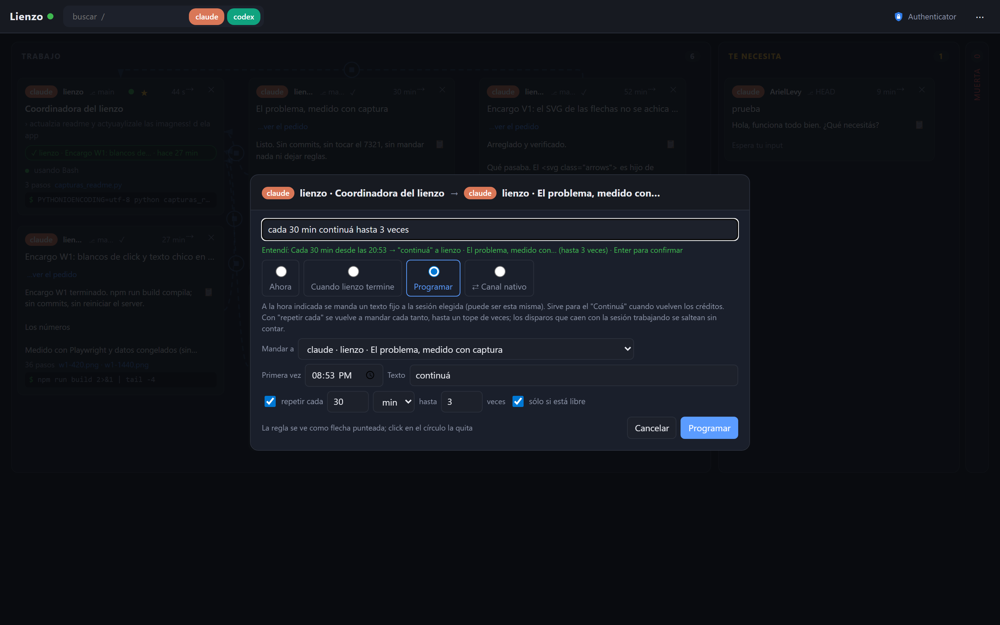
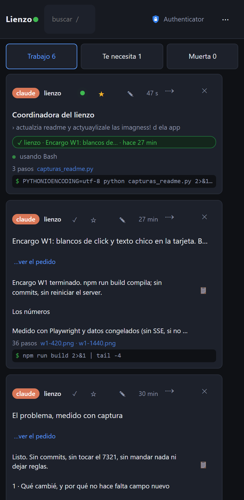

# Lienzo

Tablero para las sesiones de **Claude Code** y **Codex CLI** que corren en terminales de
Windows: la integrada de VS Code, Windows Terminal, una PowerShell o un cmd sueltos. Una
tarjeta por sesión, agrupadas por columna (trabajo, te necesita, muerta), con la
conversación a un click, una caja para contestarles, aprobación de permisos sin ir a la
terminal, conexiones entre sesiones y acceso desde el celular con Microsoft Authenticator.

No hospeda terminales ni guarda historial propio: es un monitor con derecho a contestar.

Las apps de escritorio de Claude y de Codex no tienen consola: sus sesiones se pueden ver
(si disparan hooks) pero no se les puede escribir desde acá.



## Cómo funciona

Al arrancar, y después cada 30 segundos, el server **recorre los procesos de la PC** y
encuentra todas las terminales de Claude Code (`claude.exe`) y Codex CLI (`codex.exe`) que
estén corriendo, aunque se hayan abierto antes de instalar nada: lee el directorio de
trabajo de cada proceso, ubica su transcripción y arma la tarjeta. Descarta las apps de
escritorio y las extensiones de VS Code, que usan los mismos nombres de ejecutable.

Después, cuatro canales, cada uno por su lado:

| Qué | Cómo |
|---|---|
| Estado de cada sesión | Hooks de los propios agentes (`SessionStart`, `UserPromptSubmit`, `Stop`, `PermissionRequest`…) que escriben un archivo en `~/.lienzo/events`. Nunca se raspa la pantalla para esto. |
| Contenido | Las transcripciones `.jsonl` que Claude Code y Codex ya escriben en disco. Se leen por la cola, nunca enteras. |
| Mandar un mensaje | Inyección de teclas en la consola del proceso por PID (`AttachConsole` + `WriteConsoleInputW`). Funciona sin foco y aunque la pestaña esté oculta. Los adjuntos viajan como ruta en el texto. |
| Contestar un permiso | El hook `PermissionRequest` es sincrónico: deja el pedido en una carpeta y espera hasta 60 s la respuesta que el tablero escribe. Si nadie contesta, el prompt aparece en la terminal como siempre. |

Además: conexiones entre sesiones (reenvío ahora, cuando termine, programado a una hora o
cada tanto con tope, canal nativo Claude a Claude), flechas entre las tarjetas por cada
conexión, y una pestaña que muestra el texto visible de la terminal leído del buffer de consola.

Cuando una consola cambia de `session_id` sin cambiar de proceso (un `/clear` o un resume
en Claude Code), la tarjeta nueva hereda el PID de la vieja y todas las conexiones que la
apuntaban: las reglas "cuando termine" y el historial de envíos pasan a la sesión nueva y
la vieja se da de baja. Una prueba manual del hook con un `session_id` inventado y el PID
de una sesión viva no la reemplaza.



## Requisitos

- Windows 10/11. Todo lo de consola es Win32 (`ctypes`), no hay versión para Linux o Mac.
- Python 3.12 o más nuevo, sólo biblioteca estándar. Sin `psutil`, sin frameworks.
- Node 20 o más nuevo para compilar la interfaz (Vite + React + TypeScript).
- Claude Code 2.1 o más nuevo, Codex CLI 0.153 o más nuevo, o los dos.
- Para el acceso remoto: `cloudflared` (`winget install Cloudflare.cloudflared`).

## Instalación

```powershell
git clone https://github.com/arielelevy/lienzo
cd lienzo\web
npm install
npm run build
cd ..
python install.py          # registra los hooks en ~/.claude/settings.json (con backup) y ~/.codex/hooks.json
.\lienzo-server.cmd        # http://127.0.0.1:7321
```

`install.py` hace merge, no pisa la configuración que ya tengas. `python install.py --uninstall`
saca los hooks. El estado vive en `%USERPROFILE%\.lienzo\` (eventos, permisos pendientes,
adjuntos, tarjetas); no toca AppData.

Codex pide confiar cada hook la primera vez que abre una sesión con `hooks.json` nuevo.

## Uso

### Tablero

Tres columnas: *Trabajo* (corriendo y terminó, el estado se ve como un punto verde o una
tilde en la tarjeta), *Te necesita* y *Muerta*. Una columna vacía se colapsa sola a una tira
vertical; click en la tira la expande, click en el título la colapsa, y la elección queda en
el navegador. Cuando hay pocas columnas abiertas, las tarjetas se reparten en hasta cuatro
subcolumnas según el ancho de la pantalla.

El buscador del encabezado (`/` lo enfoca) filtra por repo, título y último pedido, y los
chips filtran por agente. Si el filtro matchea tarjetas de una columna colapsada, esa
columna se abre sola mientras dure el filtro.

Click en una tarjeta abre el panel, pegado a la derecha; el tablero se corre y sigue usable.
Click en otra tarjeta cambia el panel, click en el vacío lo cierra. Pestañas: *Destacados*
(por turno: pedido, respuesta, archivos tocados, comandos, errores, preguntas, mensajes a
otras sesiones), *Conversación* (la transcripción completa, con las herramientas
colapsadas), *Pantalla* (el buffer de la terminal) y *Conexiones* (lo que recibió, lo que
mandó, lo que le escribiste desde el lienzo, y las conexiones activas con su estado).

### Tarjeta

- Título: el que Claude le pone a la sesión, o la primera línea del pedido. Doble click
  sobre el título lo renombra en el lugar; el nombre queda fijo aunque la sesión cambie de
  tema. Cuando el título es el propio pedido, la línea del pedido no se repite.
- Último pedido plegado a una línea ("…más" lo abre), última respuesta, y un botón para
  copiarla.
- Sesión ociosa con consola: botones rápidos "Continuá", "sí", "no", que se escriben en su
  terminal. Si está esperando input, la misma línea lo dice.
- Sesión libre (viva, con consola y sin ningún pedido todavía): borde punteado, la línea
  "Libre · sin pedidos todavía · desde hace N" en vez de "(sin título)", y un único botón
  "Darle trabajo" que abre el panel con el cursor en la caja de envío.
- Límite de uso: el error se ve en rojo. Si el aviso trae la hora en que vuelve el cupo
  ("try again at 1:00 AM", "resets 2:40pm"), aparece el botón "Continuar a las HH:MM", que
  deja programado escribir "Continuar" un minuto después de esa hora. Si ya hay una regla a
  esa hora, se muestra el chip en vez del botón.
- Chips de conexiones: "al terminar → repo · título", "recibe de …", "⏰ 01:01 → Continuar",
  "↻ cada 30 min · próx. 09:30 → Continuá (1/5)". Las iguales se agrupan (×N); con más de
  tres, el resto se ve en la pestaña Conexiones. Dos programadas al mismo minuto hacia la misma
  tarjeta llevan un ⚠.
- Chip "✓ informe de X hace N min" cuando otra sesión le mandó algo en la última media hora.
- La sugerencia 💡 que la terminal esté mostrando en ese momento.
- Con *Detalles técnicos* apagado (menú ⋯, el estado por defecto), no se ven el PID, los
  hooks ni el id de la sesión, ni los contadores en cero del digest, ni el nombre del
  `.jsonl` en el panel. Prendelo para depurar.

### Enviar

Caja de texto al pie del panel. Enter manda. Más de 500 caracteres o varias líneas viajan
como un `.md` adjunto y el agente lo lee por ruta. Se pueden arrastrar archivos e
imágenes. Si la terminal muestra una sugerencia, aparece en gris en la caja y Tab la
escribe, igual que en Claude Code.

La casilla "avisarme cuando termine" convierte el envío en una delegación: además de
mandar el texto, crea la regla "cuando termine" desde esa sesión hacia la coordinadora (la
primera sesión de Claude del mismo repo que no sea el destino). Un gesto en vez de dos.

Lo que escribís desde el lienzo queda en la pestaña Conexiones de esa sesión como
"recibido de vos (lienzo)". No dibuja flecha.

### Permisos

Cuando una sesión pide permiso, la tarjeta muestra el comando y dos botones, Permitir y
Denegar. Nunca "permitir siempre".

### Conectar sesiones

Arrastrá una tarjeta y soltala sobre otra (o "Conectar…" en el panel). Se abre un diálogo
chico donde podés escribirlo en una frase, y se interpreta mientras tipeás: "continuá a las
16:00", "en 30 min seguí", "cada 30 min continuá hasta 6 veces", "todos los días a las 9
continuá", "cuando termine mandale a MAPO", "cuando termine avisame", "cada vez que termine
pasale a Teorema hasta 3 veces". "Avisame" es la coordinadora (la primera sesión de Claude del
mismo repo). Enter confirma. Si no se entiende la frase, los controles de abajo quedan como
estaban y el resumen lo dice.

Soltar la tarjeta **sobre sí misma** es el bucle: abre el mismo diálogo en modo Programar con
destino "esta misma sesión". El aviso durante el arrastre cambia cuando el mouse está sobre
la tarjeta de origen. Cuatro modos:

- *Ahora*: manda la última respuesta de A a B, con plantilla editable
  (`{repo} {agente} {titulo} {pedido} {respuesta}`).
- *Cuando A termine*: al cerrar cada turno, su respuesta completa va a B. Una vez, o
  repetida hasta un tope (50 como máximo). No dispara si el turno terminó con error o con
  una pregunta para vos, y hay un enfriamiento de 30 s entre disparos.
- *Programar*: un texto fijo (por defecto "Continuá") a una sesión, que puede ser la misma,
  a una hora. Es el "seguí" para cuando vuelven los créditos. Con "repetir cada N min/h" se
  vuelve periódica: se manda cada tanto hasta un tope de veces (5 por defecto, 50 como máximo;
  no hay periódica sin tope), y con "sólo si está libre" (prendido por defecto) los disparos
  que caen mientras la sesión trabaja se saltean sin contar. Si el server estuvo caído, los
  disparos perdidos no se recuperan: el siguiente cae en la grilla original.
- *Canal nativo* (sólo Claude a Claude): A ubica a B con `ListAgents` y le habla con
  `SendMessage`; los mensajes llegan aunque B esté trabajando y se responden por el mismo
  canal. Vos les das el tema; ellas conversan.

El server rechaza con 409 una regla "cuando termine" que cierre un bucle A↔B, y también una
regla igual a otra que ya existe (mismo origen, destino, texto y hora).

### Flechas

Cada conexión se dibuja entre las tarjetas: el último envío de cada par con ↪ (o ×N si hubo
varios), las reglas pendientes punteadas con ⏹, ⏰ o ↻ (periódica), el canal nativo con una
flecha doble gruesa. Las reglas de una sesión hacia sí misma no tienen flecha, sólo chip. Viajan por el canal entre columnas, el glifo cae en el hueco para no robarle el
click a ninguna tarjeta, y al pasar el mouse sobre una tarjeta se resaltan las suyas. Un
botón del menú las oculta.

- Click en el glifo quita la conexión, con confirmación.
- Doble click en una regla la edita en el lugar: texto, hora, repetición, tope y, en una
  programada, "repetir cada" y "sólo si está libre". Una programada que ya disparó se puede
  reprogramar y vuelve a quedar vigente.
- Doble click en un envío hecho muestra los mensajes de ese par y, si el destino tiene
  consola, "Mandar de nuevo" escribe el último otra vez. Un envío hecho no se edita.

### Continuar solo tras límite de uso

En el menú ⋯ hay un toggle "Continuar solo tras límite de uso". Prendido, cuando una
sesión avisa que llegó al límite con hora de vuelta, el server deja programada la regla
"Continuar" un minuto después, una sola vez por aviso; si borrás la regla, no la vuelve a
crear. El toggle escribe `auto_continue` en `~/.lienzo/config.json`. Es la única
automatización que corre sin que hagas nada, y tiene tope: una regla de un disparo.

## Delegar trabajo a varias sesiones

El flujo que le da sentido al tablero: abrís dos o tres terminales de Claude Code, y desde el
lienzo le mandás a cada una una tarea (texto largo, viaja como adjunto) con "avisarme cuando
termine" marcado. Cada consola trabaja en sus archivos, y su informe final llega solo a la
coordinadora al cerrar el turno. La coordinadora verifica, commitea y reparte la ronda
siguiente. Este repo se construyó así: la mayoría de los commits del 5 de septiembre los
hicieron otras sesiones de Claude a partir de encargos y revisiones repartidos desde el
propio lienzo, incluidos los planes de producto de `docs/plan-pm-2026-09-05.md` y
`docs/plan-pm-2026-09-06.md`, que salieron de probar el lienzo por la interfaz y repartir lo
encontrado a tres sesiones en paralelo.

Es manual a propósito: dos agentes vinculados en los dos sentidos se contestan hasta agotar
los créditos, por eso el server rechaza el bucle y cada regla tiene tope.





## Acceso desde el celular

```powershell
.\lienzo-server.cmd --remote
```

En la PC, botón **Acceso remoto**: genera una clave TOTP y muestra dos QR. El primero se
escanea desde adentro de Microsoft Authenticator (Agregar cuenta → Otra cuenta); el segundo,
con la cámara, abre el tablero en el teléfono. Desde afuera se entra con el código de 6
dígitos; en la PC no se pide login nunca.

Por debajo: túnel `cloudflared` con TLS (sin abrir puertos ni tocar el router), cookie de
sesión de 7 días, cinco intentos fallidos bloquean el login 15 minutos, y el server sólo
escucha en `127.0.0.1`. La URL del túnel rápido cambia en cada arranque; para una URL fija
hace falta un túnel con nombre y un dominio en Cloudflare.



## API

Todo en `http://127.0.0.1:7321`, JSON. Las escrituras exigen el header `X-Lienzo: 1`; por el
túnel, además la cookie de sesión.

| Método | Ruta | Qué hace |
|---|---|---|
| GET | `/sessions` | todas las tarjetas, con `alive` recalculado |
| GET | `/sessions/<sid>/turns?n=10` | turnos de la transcripción, para la conversación |
| GET | `/sessions/<sid>/digest?n=10` | destacados por turno |
| GET | `/sessions/<sid>/screen` | texto visible de la terminal |
| GET | `/sessions/<sid>/connections` | links y reglas donde esa sesión es origen o destino, con la otra punta resuelta a `{session_id, name}`; lo que mandó el usuario viene como "vos (lienzo)" |
| POST | `/sessions/<sid>/send` | `{text, attachments}`; con `from` y `link_to` registra el envío entre sesiones, con `native` lo marca como canal nativo |
| POST | `/sessions/<sid>/attach` | sube un archivo (header `X-Filename`), devuelve la ruta |
| PUT | `/sessions/<sid>/title` | `{title}`; el título pasa a ser del usuario y no se recalcula |
| DELETE | `/sessions/<sid>` | saca la tarjeta |
| GET | `/links` | envíos hechos; `kind` es `send`, `rule`, `native` o `user` |
| GET | `/rules` | conexiones pendientes y cumplidas |
| POST | `/rules` | `{kind: on_stop\|at, from, to, text, at, repeat, max_fires}`; una `at` acepta además `every_s` (segundos, mínimo 60; periódica) y `skip_busy`; con `every_s`, `max_fires` vale 5 si no viene y `skip_busy` true; 409 si arma un bucle o ya existe |
| PUT | `/rules/<id>` | edita texto, hora (`at`), `repeat`, `max_fires`, y en una `at` también `every_s` (null la vuelve de un disparo) y `skip_busy`; reprogramar una `at` cumplida la reactiva |
| DELETE | `/links/<id>`, `/rules/<id>` | quita la flecha o la conexión |
| GET | `/pending` | permisos esperando respuesta |
| POST | `/pending/<id>` | `{decision: allow\|deny}` |
| GET | `/config` | `{auto_continue}` |
| PUT | `/config` | `{auto_continue: true\|false}`; sólo esa clave, el resto de `config.json` no se toca |
| GET | `/events` | SSE con cada cambio de sesiones, pendientes, links, reglas |
| POST | `/rescan` | barrido de procesos ahora |
| GET | `/auth`, POST `/setup`, `/login`, `/logout`, GET `/enroll` | acceso remoto |

## Estructura

```
lienzo/
  hook.py          hook único para los dos agentes; espera de permisos con nonce
  procinfo.py      ctypes mínimo compartido: padre, imagen, vivo, agente
  transcripts.py   lectura por la cola de las transcripciones, digest por turno, hora del límite de uso
  procs.py         liveness, barrido de procesos, cwd por PEB
  send.py          inyección de teclas por PID
  screen.py        lectura del buffer de consola por PID
  auth.py          TOTP (RFC 6238), cookies, freno de intentos
  state.py         estado compartido: listas JSON (links, reglas), config, broadcast SSE
  sessions.py      registro de sesiones, máquina de estados, eventos de hooks, barrido, envío
  rules.py         reglas "cuando termine" y "a las HH:MM" (una vez o cada every_s con tope), regla automática "Continuar", disparo y purga
  server.py        handler HTTP + SSE, túnel, arranque de los hilos
web/               interfaz (Vite + React + TypeScript); `npm run build` deja web/dist
  src/arrows-geometry.ts   geometría de las flechas y etiquetas de período, funciones puras con tests propios
  src/nl.ts                parser de frases ("cada 30 min continuá hasta 6 veces"), con tests propios
tests/             pytest: transcripciones reales, procesos vivos y la máquina de estados del server
install.py         alta y baja de los hooks
lienzo-server.cmd  arranque
```

```powershell
python -m pytest tests -q                                   # 34 tests
cd web; node --experimental-strip-types src/arrows-geometry.test.ts   # 19 tests de las flechas
cd web; node --experimental-strip-types src/nl.test.ts                # 20 aserciones del parser de frases
```

## Qué es cada archivo de estado

```
~/.lienzo/
  events/        eventos de hooks (el server los consume y borra)
  pending/       permisos esperando respuesta
  answers/       respuestas a permisos
  adjuntos/      archivos y textos largos enviados a las sesiones
  sessions/      una tarjeta por sesión
  links.json     envíos hechos (flechas y pestaña Conexiones)
  rules.json     conexiones (cuando termine, a una hora), vigentes y cumplidas
  config.json    auto_continue, y lo que comparte con hook.py (espera de permisos, ejemplos)
  auth.json      clave TOTP del acceso remoto
  lienzo.log
```

## Limitaciones conocidas

- La inyección escribe en la misma caja que tu teclado: si estás tipeando en esa terminal,
  los dos textos se mezclan. La tarjeta avisa cuando detecta tipeo; mandale a sesiones que no
  estés usando a mano en ese momento.
- El stream de eventos (SSE) no pasa por el túnel rápido de Cloudflare; desde el celular el
  tablero se actualiza por sondeo cada 4 segundos.
- Las sugerencias de prompt que muestra Claude Code no quedan en ningún archivo; se leen
  del buffer de la terminal cuando la sesión está ociosa. Si vos estás tipeando en esa
  terminal, lo que escribís se ve como sugerencia hasta que lo mandás.
- Los nombres internos con que las sesiones de Claude se ven entre sí (`lienzo-b7`) no se
  pueden mapear al `session_id` desde afuera; el canal nativo lo resuelve la propia sesión
  con `ListAgents`.
- Una sesión cuya terminal se cerró (el proceso sigue, el shell padre murió) se muestra pero
  no acepta mensajes: no hay consola donde escribir.
- Las flechas no se dibujan en pantallas de menos de 900 px; ahí el tablero es una columna
  por vez con selector arriba.

## Licencia

MIT. La lista de palabras `lienzo/eff_large_wordlist.txt` es de la
[EFF](https://www.eff.org/dice), licencia CC BY 3.0.
