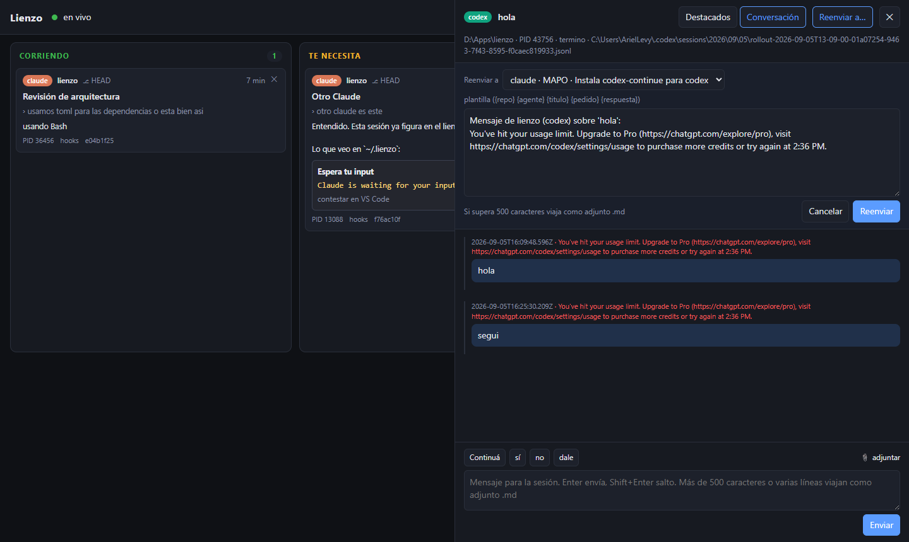

# Lienzo

Tablero para las sesiones de **Claude Code** y **Codex CLI** que corren en la terminal de
VS Code. Una tarjeta por sesión, agrupadas por estado (corriendo, te necesita, terminó,
muerta), con la conversación a un click, una caja para contestarles, aprobación de permisos
sin ir a la terminal y acceso desde el celular con Microsoft Authenticator.

No hospeda terminales ni guarda historial propio: es un monitor con derecho a contestar.


## Cómo funciona

Cuatro canales, cada uno por su lado:

| Qué | Cómo |
|---|---|
| Estado de cada sesión | Hooks de los propios agentes (`SessionStart`, `UserPromptSubmit`, `Stop`, `PermissionRequest`…) que escriben un archivo en `~/.lienzo/events`. Nunca se raspa la pantalla para esto. |
| Contenido | Las transcripciones `.jsonl` que Claude Code y Codex ya escriben en disco. Se leen por la cola, nunca enteras. |
| Mandar un mensaje | Inyección de teclas en la consola del proceso por PID (`AttachConsole` + `WriteConsoleInputW`). Funciona sin foco y aunque la pestaña esté oculta. Los adjuntos viajan como ruta en el texto. |
| Contestar un permiso | El hook `PermissionRequest` es sincrónico: deja el pedido en una carpeta y espera hasta 60 s la respuesta que el tablero escribe. Si nadie contesta, el prompt aparece en la terminal como siempre. |

Además: barrido de procesos para encontrar sesiones abiertas antes de instalar los hooks
(con el directorio de trabajo leído del PEB del proceso), reenvío de la respuesta de una
sesión a otra con plantilla (y una flecha entre las tarjetas), y una pestaña que muestra el
texto visible de la terminal leído del buffer de consola.


## Requisitos

- Windows 10/11. Todo lo de consola es Win32 (`ctypes`), no hay versión para Linux o Mac.
- Python 3.12 o más nuevo, sólo biblioteca estándar. Sin `psutil`, sin frameworks.
- Node 20 o más nuevo para compilar la interfaz (Vite + React + TypeScript).
- Claude Code 2.1 o más nuevo, Codex CLI 0.153 o más nuevo, o los dos.
- Para el acceso remoto: `cloudflared` (`winget install Cloudflare.cloudflared`).

## Instalación

```powershell
git clone https://github.com/arielelevy/lienzo
cd lienzo\web
npm install
npm run build
cd ..
python install.py          # registra los hooks en ~/.claude/settings.json (con backup) y ~/.codex/hooks.json
.\lienzo-server.cmd        # http://127.0.0.1:7321
```

`install.py` hace merge, no pisa la configuración que ya tengas. `python install.py --uninstall`
saca los hooks. El estado vive en `%USERPROFILE%\.lienzo\` (eventos, permisos pendientes,
adjuntos, tarjetas); no toca AppData.

Codex pide confiar cada hook la primera vez que abre una sesión con `hooks.json` nuevo.

## Uso

- **Tablero**: cuatro columnas por estado; las vacías se colapsan. Click en una tarjeta abre
  el panel con *Destacados* (por turno: pedido, respuesta, archivos tocados, comandos,
  errores, preguntas), *Conversación* (la transcripción completa, con las herramientas
  colapsadas) y *Pantalla* (el buffer de la terminal).
- **Enviar**: caja de texto al pie del panel. Enter manda. Más de 500 caracteres o varias
  líneas viajan como un `.md` adjunto y el agente lo lee por ruta. Se pueden arrastrar
  archivos e imágenes.
- **Permisos**: cuando una sesión pide permiso, la tarjeta muestra el comando y dos botones,
  Permitir y Denegar. Nunca "permitir siempre".
- **Reenviar a…**: manda la última respuesta de una sesión a otra, con una plantilla editable
  (`{repo} {agente} {titulo} {pedido} {respuesta}`). Cada reenvío dibuja una flecha entre las
  dos tarjetas. Es manual a propósito: dos agentes vinculados en los dos sentidos se
  contestan hasta agotar los créditos.



## Acceso desde el celular

```powershell
.\lienzo-server.cmd --remote
```

En la PC, botón **Acceso remoto**: genera una clave TOTP y muestra dos QR. El primero se
escanea desde adentro de Microsoft Authenticator (Agregar cuenta → Otra cuenta); el segundo,
con la cámara, abre el tablero en el teléfono. Desde afuera se entra con el código de 6
dígitos; en la PC no se pide login nunca.

Por debajo: túnel `cloudflared` con TLS (sin abrir puertos ni tocar el router), cookie de
sesión de 7 días, cinco intentos fallidos bloquean el login 15 minutos, y el server sólo
escucha en `127.0.0.1`. La URL del túnel rápido cambia en cada arranque; para una URL fija
hace falta un túnel con nombre y un dominio en Cloudflare.


## Estructura

```
lienzo/
  hook.py          hook único para los dos agentes; espera de permisos con nonce
  transcripts.py   lectura por la cola de las transcripciones y digest por turno
  procs.py         liveness, barrido de procesos, cwd por PEB
  send.py          inyección de teclas por PID
  screen.py        lectura del buffer de consola por PID
  auth.py          TOTP (RFC 6238), cookies, freno de intentos
  server.py        watcher, registro, máquina de estados, HTTP + SSE, túnel
web/               interfaz (Vite + React + TypeScript); `npm run build` deja web/dist
install.py         alta y baja de los hooks
lienzo-server.cmd  arranque
```

## Limitaciones conocidas

- La inyección escribe en la misma caja que tu teclado: si estás tipeando en esa terminal,
  los dos textos se mezclan. Mandale a sesiones que no estés usando a mano en ese momento.
- El stream de eventos (SSE) no pasa por el túnel rápido de Cloudflare; desde el celular el
  tablero se actualiza por sondeo cada 4 segundos.
- Las sugerencias de prompt que muestra Claude Code no quedan en ningún archivo; se leen
  del buffer de la terminal y el detector todavía es una heurística.
- Una sesión cuya terminal se cerró (el proceso sigue, el shell padre murió) se muestra pero
  no acepta mensajes: no hay consola donde escribir.

## Licencia

MIT. La lista de palabras `lienzo/eff_large_wordlist.txt` es de la
[EFF](https://www.eff.org/dice), licencia CC BY 3.0.
