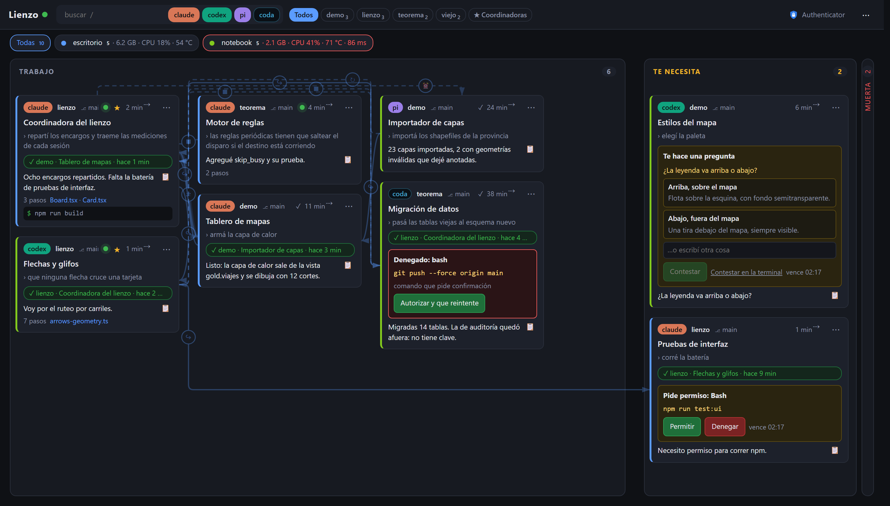
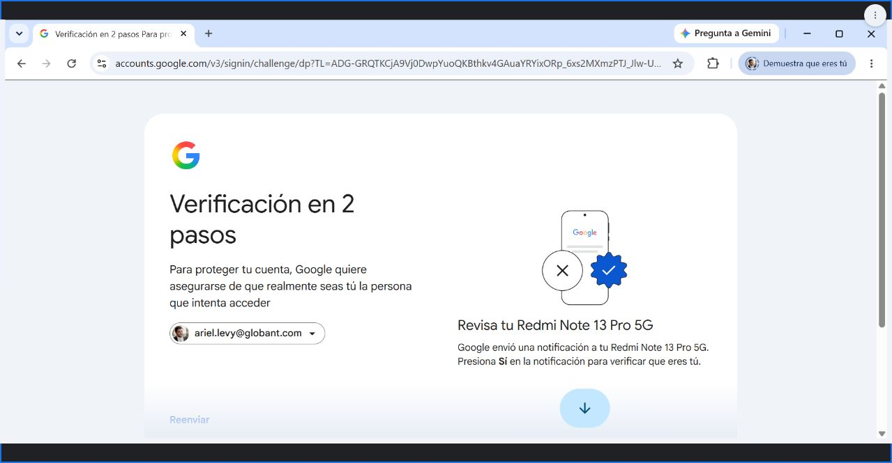
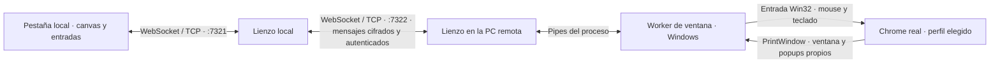
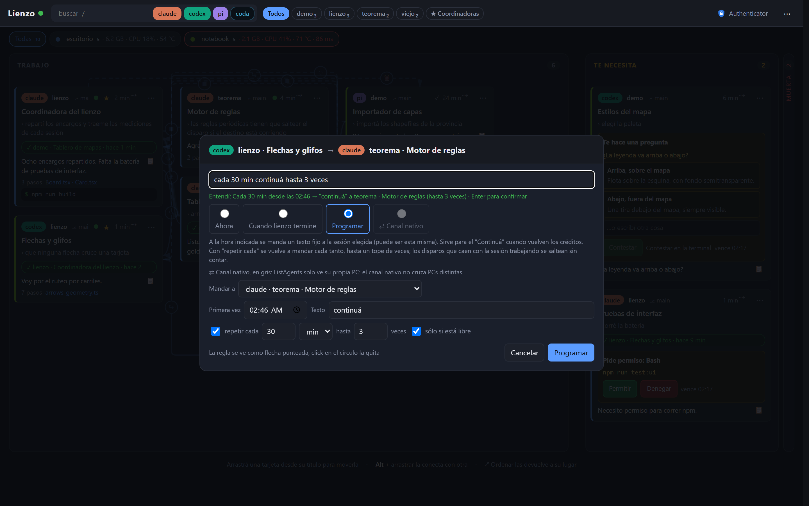
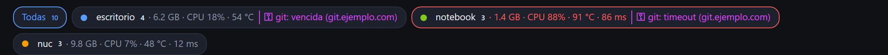

# Lienzo

Lienzo muestra las sesiones de Claude Code, Codex CLI, Pi CLI, CODA y Kiro V3 que corren en terminales.
Cada sesión tiene su tarjeta. Desde ahí podés leer la conversación, mandar mensajes y aprobar
permisos. También pegar capturas con Ctrl+V y conectar sesiones.
Hasta 4 PCs de la misma LAN comparten el tablero.

Corre en `127.0.0.1:7321`. Lee el historial de cada agente y escribe en su terminal.
Las terminales y las transcripciones siguen a cargo de los agentes.

Kiro V3 en Windows usa su historial `~/.kiro/sessions/*/sess_*/messages.jsonl`,
vinculado al PID de su motor mediante el lock de sesión y el proceso CLI padre.
Sus permisos y los de Codex se muestran como diálogos en las tarjetas; se responden
con flechas y Enter, verificando antes que el pedido siga abierto. Kiro se lanza
por su ruta instalada en `%LOCALAPPDATA%/Kiro-Cli` con `--v3` y retoma por `--resume-id`.
Todas las CLI pueden marcarse como coordinadora mediante las conexiones del tablero.

[Arquitectura y recorridos de los pedidos](https://arquitectura-lienzo.ariel-e-levy.chatgpt.site/)

[Diseño y decisiones de arquitectura](https://arquitectura-lienzo.ariel-e-levy.chatgpt.site/)

[Mejoras pendientes y evidencia](MEJORAS.md)



## Cómo funciona

Cada 30 s el server recorre los procesos de la PC y arma una tarjeta por cada agente que encuentra,
aunque se haya abierto antes de instalar nada (descarta las apps de escritorio y las extensiones de
VS Code). El estado, el contenido y los envíos usan estos canales:

| Qué | Cómo |
|---|---|
| Estado | Hooks en `~/.lienzo/events`, procesos y fuentes propias de cada agente. Algunos diálogos de permisos se reconocen en el buffer de consola. |
| Contenido | Las transcripciones que los agentes ya escriben (`.jsonl`; en CODA, su base local), leídas por la cola. |
| Mandar un mensaje | Teclas en la consola del proceso por PID (`AttachConsole` + `WriteConsoleInputW`), sin foco. Lo largo viaja como `.md` adjunto. |
| Contestar un permiso | El hook `PermissionRequest` espera hasta 60 s la respuesta del tablero; si nadie contesta, el prompt aparece en la terminal como siempre. En CODA, Permitir y Denegar se teclean en su diálogo. |
| Contestar una pregunta | `AskUserQuestion` llega por el mismo hook; la opción elegida vuelve en la decisión. |

Una consola que cambia de `session_id` sin cambiar de proceso (un `/clear`, un resume) le pasa sus
conexiones a la tarjeta nueva.

## Requisitos

- Windows 10/11 (probado de punta a punta). Mac, Linux y WSL van por tmux, ver [Mac, Linux y WSL](#mac-linux-y-wsl).
- Python 3.14+, sólo biblioteca estándar.
- Node 24 LTS para compilar la interfaz.
- Claude Code 2.1+, Codex CLI 0.153+, Pi CLI 0.86+ o CODA.
- `cloudflared`, sólo para el acceso desde el celular.

## Instalación

```powershell
git clone https://github.com/arielelevy/lienzo
cd lienzo\web; npm install; npm run build; cd ..
py -3.14 install.py        # hooks de Claude/Codex/CODA y la extensión Pi (--pi-only, --coda-only)
.\lienzo-server.cmd        # http://127.0.0.1:7321
```

`install.py` hace merge y no pisa tu configuración; `--uninstall` saca los hooks. El estado vive en
`%USERPROFILE%\.lienzo\`. Codex pide confiar cada hook la primera vez. En Pi, `/reload` carga la
extensión; en CODA, `/reload-hooks`.

**Después de un `git pull`, reiniciar.** El server sigue con el código viejo hasta `POST /restart`
(o `coordinar.reiniciar()`; con `pc`, reinicia otra PC). Comprueba que el código compile, sale con
75 y `lienzo-server.cmd` lo relanza en la misma ventana; si algo no compila, contesta 409 y sigue
con lo viejo. Si cambió algo de `web/`, antes `npm run build`: `web/dist` no viaja con git.
`"auto_reload": true` en `config.json` lo reinicia solo con cada `.py` (apagado: cortaba el trabajo
de los agentes).

### Mac, Linux y WSL

Lo atado a Win32 son dos piezas: escribir en la consola de otro proceso y leer su buffer. Fuera de
Windows van por tmux (`send-keys`, `capture-pane`). Un tablero en Windows ve también los agentes de
WSL y les escribe por `wsl.exe`.

Para escribirle a un agente, tiene que haber nacido adentro de tmux (en Unix un PTY es de quien lo
creó). Leerlo no lo necesita: uno abierto suelto aparece en solo lectura. `./lienzo-new.sh claude`
abre uno en tmux, y `POST /sessions/launch` en Mac/Linux/WSL siempre usa tmux. El server arranca con
`./lienzo-server.sh`. Probado: un tablero de Windows manejando agentes en tmux de WSL. Sin probar:
el server nativo en Linux y un Mac. Lienzo no usa `TIOCSTI` (apagado en los kernels modernos por
seguridad).

## Uso

### Tablero

Tres columnas: Trabajo (corriendo y terminó), Te necesita (pide permiso, pregunta o está
libre) y Muerta. `/` busca; los chips filtran por agente, PC y proyecto (Ctrl+click suma varios).
Click en una tarjeta la elige y resalta sus conexiones; doble click abre el panel (pestañas *Chat*,
*Pantalla* y *Conexiones*); Esc cierra de a una capa. Las tarjetas se pueden arrastrar a otro lugar
(⤢ Ordenar las devuelve); las posiciones y los filtros viven en el navegador.

Ctrl+click arma una selección múltiple: Enviar a todas, Interrumpir (un Esc a cada una) o
Marcar las visibles.

### Chrome remoto

El enlace **Chrome remoto** del encabezado abre `/chrome` en una pestaña nueva del navegador.
Elegí una PC. **Chrome real · ventana completa** muestra su ventana de Chrome dentro de esa
pestaña: sus pestañas, barra de direcciones, menús y avisos. Los controles de Lienzo quedan en
el menú **⋮**, para dejar espacio al navegador; también podés usar pantalla completa.
Las páginas, el teclado y el mouse se ejecutan en la PC elegida. La PC debe estar encendida y con
Lienzo abierto; perder la conexión no abre un Chrome sustituto en otra máquina.

En Windows, la vista de ventana completa recuerda el perfil elegido para cada PC. Al entrar,
conecta con una ventana existente; si no hay ninguna, abre automáticamente el perfil recordado
o el primero disponible. **Abrir perfil** permite elegir otro, como Globant. Este modo controla
la sesión gráfica de esa PC y no requiere habilitar la depuración remota de Chrome.
Cerrar la vista deja Chrome abierto.

Los menús y popups propios de Chrome se incluyen dentro del área de la ventana compartida;
los que sobresalen de ese borde quedan recortados. El cursor remoto transmite las formas
habituales, como mano sobre enlaces y cursor de texto. En pantalla táctil, tocar hace clic y
arrastrar desplaza la página. El mouse y el teclado físicos también permiten controlar la ventana.
La imagen y las entradas usan un canal persistente; los movimientos se agrupan para enviar la
posición más reciente y las actualizaciones de imagen omiten regiones que no cambiaron.




```mermaid
flowchart LR
    V["Pestaña local · canvas y entradas"] <-->|"WebSocket / TCP · :7321"| L["Lienzo local"]
    L <-->|"WebSocket / TCP · :7322 · mensajes cifrados y autenticados"| R["Lienzo en la PC remota"]
    R <-->|"Pipes del proceso"| W["Worker de ventana · Windows"]
    W -->|"Entrada Win32 · mouse y teclado"| C["Chrome real · perfil elegido"]
    C -->|"PrintWindow · ventana y popups propios"| W
```

**Transporte y latencia.** La vista de ventana completa usa WebSocket (RFC 6455) sobre **TCP**;
no usa UDP ni RDP. La conexión se abre con un Upgrade HTTP y permanece abierta: no hace un
pedido HTTP por cada movimiento o cuadro. Entre PCs, cada mensaje va cifrado y autenticado
con un contador por sentido. UDP se usa para descubrir PCs en la LAN, no para transmitir Chrome.

El worker compara capturas y envía PNG binario de la región modificada, o un cuadro completo
cuando corresponde. Si no cambia la imagen, no la reenvía. El visor confirma los cuadros dibujados
y hay como máximo **dos sin confirmar**, para acotar la cola. Los movimientos consecutivos
conservan la posición más reciente y se despachan con `requestAnimationFrame`; clics y teclas
no esperan la siguiente captura. La entrada despierta la captura en reposo y una vista oculta
pausa las imágenes. Imagen y entrada comparten el transporte TCP: la congestión todavía puede
agregar demora. No hay una medición publicada de latencia de extremo a extremo ni una garantía
de equivalencia con RDP.

**Vista por pestañas** ofrece otra forma de navegar, con pestañas, dirección/búsqueda,
atrás, adelante y recarga propios de Lienzo. Usa la depuración remota de Chrome. Las dos PCs
necesitan esta versión de Lienzo; la que ejecuta Chrome necesita **Chrome instalado y
Node.js 24 o posterior**. Para usar sus perfiles existentes (por ejemplo Globant), elegí uno y
tocá **Abrir perfil en esa PC**. En el Chrome de destino, versión 144 o posterior, habilitá
`chrome://inspect/#remote-debugging`. Tocá **Conectar Chrome abierto** en Lienzo y aceptá el aviso
de Chrome en el destino. Chrome decide qué perfil comparte; con varios abiertos usa su perfil
predeterminado. Abrir un perfil desde Lienzo no garantiza que Chrome comparta ese perfil.
**Desconectar** deja Chrome y sus pestañas abiertos. No se copian cookies ni se modifican sus
preferencias para habilitar la conexión. La autorización inicial requiere interacción en el
Chrome de destino; no se promete que este modo funcione sin monitor o sesión gráfica activa.

La alternativa **Usar un perfil separado de Lienzo → Abrir Chrome** usa un perfil persistente en
`~/.lienzo/chrome-remoto`, en modo headless, sin monitor. **Cerrar Chrome** cierra sólo ese proceso.
Volver al tablero o cerrar la pestaña local conserva el navegador remoto. Se admite abrir hasta
doce pestañas desde Lienzo. El acceso se realiza desde el
tablero local de una PC emparejada, no desde el túnel público del celular.

El canal de peers autentica los pedidos y cifra el contenido y las entradas del navegador. El
puerto de control de Chrome queda en loopback, sin abrir otro puerto en la LAN. No acepta comandos
CDP arbitrarios ni navegación directa a `file:` o `javascript:` en la vista por pestañas. En esa vista,
Ctrl+C copia texto seleccionado y
Ctrl+V pega texto; los diálogos JavaScript se contestan dentro de la vista. La imagen se actualiza
por capturas: no transmite audio. Las descargas se deshabilitan sólo en el perfil separado;
en Chrome habitual se conserva su configuración y los archivos quedan en la PC remota. Carga de archivos, ventanas
del sistema y extensiones no están integradas en la vista por pestañas.

Prueba aislada propuesta: `py tests/browser_smoke.py` (Chrome real, perfil temporal y web local,
sin cuentas ni sitios externos). UI con fixtures: `chrome.spec.ts`. Su ejecución y las limitaciones
de la corrida se registran con `pruebas-agenticas`; no se fijan baselines automáticamente.

### La tarjeta

Título (✎ para renombrar), último pedido, lo que el agente viene escribiendo en este turno, pasos,
errores, archivos tocados, último comando y la sugerencia 💡 de la terminal. La ★ marca la
coordinadora del repo: es a quien van los avisos «cuando termine». Según el caso aparecen
«Continuar a las HH:MM» (límite de uso) o «↻ Reintentar» (error de API). Los menús numerados de la
TUI («Switch model?») se muestran con sus opciones y se eligen desde ahí.

### Contestar, aprobar, adjuntar

- Contestar: la caja del panel; se escribe en su terminal aunque esté oculta. Tab escribe la
  sugerencia que muestra la terminal.
  En Codex CLI sobre Windows, el envío espera a que la consola consuma el texto y deja una pausa
  antes del Enter para que el mensaje se publique. Si la cola no se vacía en 10 s, informa el error.
- Permisos: Permitir o Denegar desde la tarjeta (nunca «permitir siempre»; vence a los 60 s).
- Denegados: lo que una regla, política o clasificador le niega al agente aparece como
  «Denegado: herramienta» con un botón «Autorizar y que reintente». Una denegación anterior al
  pedido en curso no vuelve a aparecer.
- Preguntas con opciones: se elige en la tarjeta, sin pasar por la terminal.
- Adjuntos: arrastrar a la caja o pegar una captura con Ctrl+V.
- «avisarme cuando termine»: manda el texto y crea la regla hacia la coordinadora.
- Copiar y pegar trabajo: Ctrl+C en una tarjeta arma un encargo con su último pedido, respuesta y
  destacados; Ctrl+V en otra lo manda. La destino hereda el título (⧉ copycat) y la de origen recibe
  un Esc y queda stopped, salvo con Duplicar.
- Stopped: la etiqueta roja. Mientras está prendida la sesión no recibe nada (envíos, reglas,
  pegados) y el lienzo avisa a la coordinadora y a sus conexiones. Se apaga con un click o sola con un
  pedido nuevo por su terminal.

### Conectar sesiones

Arrastrar una tarjeta desde ⇢ (o con Alt) y soltarla sobre otra; se escribe en una frase que se
interpreta al tipear: «continuá a las 16:00», «cada 30 min continuá hasta 6 veces», «cuando termine
mandale a demo». Modos: *Ahora*, *Cuando termine*, *Programar* (a una hora o cada tanto, con tope) y
*Canal nativo* (Claude a Claude, `SendMessage`). Toda regla tiene tope; el server rechaza el bucle
A↔B, la regla repetida y dos programadas al mismo minuto hacia la misma sesión. Cada conexión se
dibuja como flecha (las de envío viven 10 minutos).



### Las automatizaciones

En el menú ⋯, apagadas por defecto:

- Continuar solo tras límite de uso: programa «Continuar» un minuto después de la hora de vuelta.
- Reintentar solo tras un error de API: «Continuar» diez segundos después.
- ☠ Auto-aprobar TODO: aprueba sin mirar cada permiso de cualquier agente, **en todas las PCs
  emparejadas**. Barra negra arriba mientras está prendido; cada aprobación queda en `lienzo.log`.
  Sólo desde la LAN. No cubre lo que el agente se deniega solo (por ejemplo, los «comandos que piden
  confirmación» de coda).

## Delegar trabajo a varias sesiones

El flujo que le da sentido al tablero: una coordinadora reparte encargos a varias terminales con
«avisarme cuando termine», cada una trabaja en lo suyo y su informe vuelve solo; la coordinadora
verifica, commitea y reparte la ronda siguiente. Es manual a propósito (dos agentes atados en los dos
sentidos se contestan hasta agotar los créditos). El método completo, escrito para que lo siga la
propia coordinadora, está en el skill [`skills/lienzo`](skills/lienzo/SKILL.md); se engancha
enlazando esa carpeta en `~/.agents/skills/`.

## Acceso desde el celular

Opcional: `.\lienzo-server.cmd --remote`. En la PC, Acceso remoto genera una clave TOTP y dos QR
(uno para Authenticator, otro para abrir el tablero). Desde afuera se entra con el código de 6
dígitos; en la PC no se pide login. Túnel `cloudflared` con TLS, sin abrir puertos; cookie de 7
días; cinco intentos fallidos bloquean 15 minutos. La URL del túnel rápido cambia en cada arranque.

## Varias PCs

Opcional, hasta 4 PCs de la misma LAN. Cada PC es dueña de lo suyo: teclas, pantalla, hooks,
permisos y recursos son de la máquina donde corre el proceso y se le piden por la red. `GET /sessions`
mezcla lo local con lo de las demás PCs, y las acciones sobre una tarjeta ajena se reenvían solas.
Si la otra PC no contesta: 503, con `"no_llego": true` sólo cuando el pedido no salió (se puede
reintentar); sin esa marca pudo haberse ejecutado allá.

### Emparejar y red

🖥 Varias PCs, en el menú ⋯: una PC ofrece una palabra, la otra la pega dentro de 5 minutos. La
clave del par sale de un intercambio SPAKE2, no de la palabra: escuchar la red no sirve y un
impostor tiene un solo intento. Las PCs con el lienzo andando se descubren solas por un beacon UDP
(7323), que también actualiza la IP si el DHCP la cambia.

Un listener aparte (7322) atiende sólo `/peer/*`, en la IP de LAN (nunca `0.0.0.0`), y cada
pedido va firmado con HMAC de la clave del par, ventana de ±30 s y nonce.
`py -3.14 install.py --peer` abre 7322 TCP y 7323 UDP sólo en el perfil Privado del firewall, y en
cualquier perfil sólo entre IP de Tailscale (100.64.0.0/10 de los dos lados).

### Cuando la red no deja verse a las PCs: Tailscale

Un Wi-Fi público (un bar, una estación de servicio) suele aislar a los clientes: la puerta de
enlace contesta, pero la otra PC no responde ni ARP y ningún paquete de la LAN pasa entre las dos.
Ni el broadcast ni el barrido unicast del beacon lo saltan. Medido el 2026-10-05 en «YPF Clientes 2».

La salida es [Tailscale](https://tailscale.com): instalarlo en las dos PCs y entrar con la misma
cuenta. Cada PC queda con una IP 100.x.y.z alcanzable desde la otra en cualquier red, y el lienzo la
usa solo:

- el beacon lee los equipos de la tailnet (`tailscale status --json`, una vez por minuto) y les
  manda sus anuncios por unicast, además del broadcast de la LAN;
- un peer queda con más de una dirección (`ips` en `peers.json`: la de la LAN y la de Tailscale). El
  espejo sigue con la que usa mientras tenga beacon; si se apaga, pasa a otra viva, la de la LAN
  antes que la de Tailscale;
- el listener de peers abre también en la IP de Tailscale (si Tailscale se prende después, lo nota
  en menos de un minuto);
- una IP sólo se acepta por el beacon firmado con la clave del par, con el ts creciente de
  siempre: la tailnet no da permiso para nada, es otro camino para el mismo paquete.

Hace falta volver a correr `install.py --peer` (como administrador) para la regla de Tailscale. Una
PC no emparejada que está en la tailnet aparece igual en «PCs de la LAN» y se empareja con la
palabra de siempre. Los pasos para cada PC están en [docs/tailscale-otra-pc.md](docs/tailscale-otra-pc.md).

Qué va por Tailscale: solo lo que va a una IP 100.x (los otros equipos de la tailnet). Internet,
el mail y una VPN corporativa siguen por su camino, salvo que se elija un *exit node*.

Lo que se aprendió al instalarlo (2026-10-05):

- `winget install --id Tailscale.Tailscale -e` lo instala sin vueltas.
- Si el login dice *«device with nodekey:… already exists; please log out explicitly»*:
  `tailscale logout` y después `tailscale up`, que queda esperando con un link nuevo. Un
  `tailscale login --timeout=…` se corta antes de que termines en el navegador y la web dice
  «Login successful» pero `tailscale status` sigue en *Logged out*.
- Las dos PCs tienen que tener este código: una PC con el lienzo viejo acepta a la otra por
  Tailscale (la conexión entra), pero no anuncia la suya ni escucha en su 100.x, y desde acá se ve
  caída.
- En una PC del trabajo, antes de instalarlo, preguntarle a IT: es un túnel que la conecta con
  equipos de una cuenta personal y puede chocar con la política o con el antivirus corporativo. Si
  se instala, apagar *Use Tailscale DNS* (MagicDNS) en esa PC para no pisar el DNS de la VPN de la
  empresa, y no usar *exit node* ni *subnet routes*.

Por qué no llega una PC: el chip de la tira dice el motivo cuando una PC está caída:

| En la tira | Qué pasa | Qué hacer |
|---|---|---|
| sin ARP: la PC no aparece en la red | apagada, dormida, en otra red, o un Wi-Fi público que aísla a los equipos | prenderla o despertarla; si está en la misma red y prendida, Tailscale o un hotspot del celular |
| la PC está en la red pero no contesta el puerto | el firewall la frena (perfil Público) o el lienzo está colgado | `install.py --peer`, o marcar la red como Privada |
| el puerto está cerrado | la PC contesta, pero no corre el lienzo con `--peers` | arrancar el lienzo en esa PC |
| la última IP conocida es de otra red | la PC cambió de red | Tailscale la encuentra en cualquiera |
| no llega por Tailscale | Tailscale apagado o con otra cuenta en alguna de las dos | prenderlo en las dos |

### Lanzar, cablear y restaurar en otra PC

- Lanzar: `POST /sessions/launch {pc, cwd, agent, title, model?}`. Sólo dentro de `launch_roots`
  (en `config.json` de esa PC; vacía es ninguna) y con los agentes admitidos por el lanzador. Ojo: el
  `--model` de coda cambia el modelo por defecto de esa PC.
- Cablear: una regla «cuando termine» puede unir PCs; vive en la PC del origen y sobrevive a los
  reinicios. `coordinar.cablear()` cablea cada frente vivo hacia la coordinadora.
- Restaurar: cada PC guarda en `~/.lienzo/restaurar.json` cómo relanzar sus agentes tras un
  reinicio (no lo que se cerró a propósito). `POST /restaurar {session_id | all: true, pc?}` los
  relanza retomando la conversación, de a uno, mirando la memoria libre.

### La tira de PCs

Arriba del tablero, un chip por PC con sus tarjetas, memoria libre, CPU, temperatura y latencia. En
rojo si pasa de 85 °C, si no le entra otro agente sin bajar de 1,5 GB libres o si un agente se
quedó sin cuota. En violeta, la credencial de git: cada PC prueba con `git ls-remote` el
`origin` de los repos con sesión viva (y los de `git_check`) y distingue `vencida`, `no verificable`,
`sin red` y `timeout`. Click en el violeta le pasa a esa PC la credencial que tiene esta, cifrada
(lo mismo que `coordinar.pasar_credencial_git`); con «sin red» o «timeout» avisa que otra credencial
no lo arregla. Una PC caída se ve en ○ y sus tarjetas quedan grises.



La ★ coordinadora es una por repo en toda la federación, independientemente de la PC. El
canal nativo (`ListAgents` / `SendMessage`) cruza PCs con Remote Control y la misma cuenta: el
lienzo lanza cada Claude con `-n <nombre> --remote-control`, y `POST /sessions/<sid>/native` (o ✎
Renombrar en la tarjeta) nombra y publica una que ya corre.

### Secretos entre PCs

Un token nunca se pega en un mensaje. `coordinar.pasar_credencial_git(pc, url)` copia la credencial
de git de esta PC a otra, cifrada, sin que ningún agente la vea. `coordinar.enviar_secreto` deja otro
secreto 10 minutos en memoria para leerlo una sola vez con `coordinar.leer_secreto`.

### Copiar archivos entre PCs

`POST /xfer {pc, origen, destino}` (o `coordinar.copiar`) copia un archivo o una carpeta de esta PC a
la carpeta `destino` de otra, por el mismo listener de peers: sin SMB, sin puerto nuevo, sin otra
credencial. Un `robocopy /Z /MT` hecho en casa:

- Por bloques y retomable. Bloques de 8 MiB, cada uno su propio pedido firmado. El que recibe
  escribe a `<archivo>.parte` y anota cada bloque verificado en `<archivo>.parte.diario`; el que manda
  guarda su avance en `~/.lienzo/xfer/trabajos/`. Un corte o un reinicio de cualquiera de las dos
  puntas retoma desde ahí.
- Paralelo. 6 bloques en vuelo (`hilos`); los archivos de menos de 1 MiB viajan en paquetes de
  hasta 256.
- Verificado. sha256 por bloque al llegar (1,5 GB/s con SHA-NI, contra 0,56 de blake2b). Al
  cerrar se relee el `.parte` entero contra la lista del que manda y recién ahí se renombra. Un bloque
  distinto se rechaza y se vuelve a mandar; un archivo que cambia en el origen mientras viaja se
  vuelve a pasar.
- Sólo lo que cambió, comparando hashes por bloque (tamaño y fecha no alcanzan).
- Nunca borra en el destino, salvo `espejo: true`, que primero lista lo que borraría y espera
  `POST /xfer/<id>/confirmar`.
- No mata la máquina. Topes `mbps` y `disco_mbps`, prioridad baja de CPU y disco, y se frena si
  cualquiera de las dos PCs baja de 1,5 GB libres (sigue sola cuando se libera).
- Rutas permitidas. Origen y destino tienen que caer en `copy_roots` del `config.json` de su PC
  (vacía es ninguna). Las de WSL, como `\\wsl.localhost\<distro>\...`.

Lo medido entre dos PCs el 2026-10-04:

- Corte provocado: con el lienzo del que recibe reiniciado al 40 % de un archivo de 2 GB, la
  copia retomó sola a los 12 s, desde el diario.
- WSL por 9p: lee un archivo grande a 149 MB/s (más que una LAN gigabit) pero sólo ~600
  archivos/s chicos con 16 hilos. Sirve para un volcado de pocos archivos grandes.
- La caché de WSL se come la memoria. Lo que pasa por 9p queda en la caché de la VM de WSL, que
  Windows cuenta como memoria de `vmmemWSL`: copiando 2 GB, la PC que recibía bajó de 2,6 a 0,5 GB
  libres y la copia se frenó sola. El canal ahora le pide a WSL que suelte la caché de cada archivo
  cada 256 MB y al cerrarlo (`dd iflag=nocache count=0`, 2 GB en 2 s). Lo que cachean otros
  procesos de WSL (una base de datos, por ejemplo) sigue ocupando: para eso, `autoMemoryReclaim` en
  `.wslconfig`.
- Velocidad sostenida: sin medir todavía. Con las dos PCs cargadas de agentes la memoria libre
  no pasó de la reserva el tiempo suficiente.

### Seguridad, en criollo

Un peer emparejado puede teclear en los agentes de la otra PC, lanzar sesiones y copiarle archivos
dentro de `copy_roots`. Lo mitiga: listener aparte sólo para `/peer/*`, bind a la IP de LAN, firewall
sólo en perfil Privado, firma con ventana y nonce en cada pedido, `launch_roots` y `copy_roots`,
peers revocables, tope de 4. Un pedido sin firma recibe 401 sin que se lea el cuerpo, y el motivo de
cada 401 queda en el log. **Con auto-aprobar prendido, una PC emparejada puede ejecutar comandos en
las otras.**

## API

Todo en `http://127.0.0.1:7321`, JSON. Las escrituras exigen el header `X-Lienzo: 1`; por el túnel,
además la cookie de sesión.

| Método | Ruta | Qué hace |
|---|---|---|
| GET | `/sessions` | todas las tarjetas, las de esta PC y las de las demás (`pc`) |
| GET | `/sessions/<sid>/turns?n=10`, `/digest?n=10`, `/screen`, `/connections` | turnos, destacados por turno, pantalla de la terminal, conexiones |
| POST | `/sessions/<sid>/send` | `{text, attachments}`; con `from` y `link_to` registra el envío; con `copycat: true` es pegar trabajo |
| POST | `/sessions/<sid>/interrupt` | un Esc: corta el turno (409 si no está corriendo) |
| POST | `/sessions/<sid>/kill` | `{confirm: session_id}`; cierre forzado de una CLI Windows identificada, también en otra PC; no cierra agentes tmux |
| POST | `/sessions/<sid>/dialog` | `{choice: n}`; elige una opción del diálogo de la TUI |
| POST | `/sessions/<sid>/approve` | `{decision: allow\|deny, expect?}`; contesta el permiso de coda en su terminal |
| POST | `/sessions/<sid>/attach` | sube un archivo (header `X-Filename`), devuelve la ruta |
| PUT | `/sessions/<sid>/title`, `/stopped`, `/coordinator` | título; la llave stopped (`{on}`); coordinadora del repo (`{on}`) |
| DELETE | `/sessions/<sid>` | saca la tarjeta |
| POST | `/sessions/launch` | `{pc?, cwd, agent, title?, model?}`; lanza una sesión, local o en otra PC |
| GET | `/peers`, `/peers/lan` | las PCs emparejadas con su salud; las de la LAN sin emparejar |
| POST | `/peers/offer`, `/peers/join` | emparejar: ofrecer la palabra, pegarla |
| DELETE | `/peers/<pc_id>` | revoca el peer |
| POST | `/restart` | `{pc?}`; reinicia el server de esta PC o de otra |
| GET, POST | `/restaurables`, `/restaurar` | sesiones para relanzar tras un reinicio; relanzarlas |
| GET, POST, PUT, DELETE | `/rules`, `/rules/<id>` | conexiones: `{kind: on_stop\|at, from, to, text, at, repeat, max_fires, every_s?, skip_busy?}`; 409 ante bucle, duplicada o choque de horario |
| POST | `/rules/retarget` | `{old, new}`; las reglas que avisaban a `old` pasan a `new`, en todas las PCs |
| GET, DELETE | `/links`, `/links/<id>` | envíos hechos (flechas) |
| GET, POST | `/pending`, `/pending/<id>` | permisos esperando; `{decision: allow\|deny}` |
| GET, PUT | `/config` | `{auto_continue, auto_retry, auto_aprobar}` |
| POST, GET | `/secrets`, `/secrets/<id>?pc=` | un secreto cifrado a otra PC (`desde: "git_local"` copia la credencial de git); leer uno lo borra |
| POST | `/xfer` | `{pc, origen, destino, hilos?, bs_mib?, mbps?, disco_mbps?, espejo?}`; copiar a otra PC, 202 con `{id}` |
| GET | `/xfer`, `/xfer/<id>` | las copias; `estado`, `pct`, `mbps`, `eta_s`, `archivos_hechos`, `errores`, `ultimos` |
| DELETE, POST | `/xfer/<id>`, `/xfer/<id>/retomar`, `/xfer/<id>/confirmar` | pausar, retomar, dejar borrar al espejo |
| GET | `/events` | SSE con cada cambio |
| POST | `/browser` | `{pc, action, ...}`; perfiles, ventanas y acciones de Chrome en la PC elegida |
| GET | `/browser/stream?pc=<pc_id>` | WebSocket persistente del modo ventana: imagen, cursor y entradas |
| GET | `/docs` | esta referencia y el diseño, con buscador |
| POST | `/rescan` | barrido de procesos ahora |
| GET, POST | `/auth`, `/setup`, `/login`, `/logout`, `/enroll` | acceso remoto |

Entre PCs hay otra API, en el listener de peers (7322): `/peer/hello` y `/peer/pair` (sin firma) y el
resto de `/peer/*` (firmado). Un envío, un lanzamiento, un adjunto o un secreto entre PCs espera hasta
70 s; una restauración con `all`, hasta 300 s.

## Estructura

```
lienzo/
  server.py        HTTP + SSE, túnel, hilos, listener de peers (7322) y sus rutas /peer/*
  sessions.py      registro de sesiones, máquina de estados, eventos de hooks, barrido, envío
  hook.py          hook único de los agentes; espera de permisos con nonce
  transcripts.py   lectura de transcripciones, digest por turno, límite de uso, denegados
  procs.py, procinfo.py, backend.py, tmux.py   procesos y fuentes (Windows, tmux de WSL/Linux)
  send.py, screen.py   escribir en la consola de un proceso y leer su buffer
  rules.py, rules_api.py   reglas «cuando termine» y programadas
  state.py         estado compartido, config, log
  federation.py    firma HMAC, peers.json, beacon, cliente SSE, transporte HTTP
  pairing.py       emparejamiento con SPAKE2
  mirror.py        espejo de cada peer, enrutado y salud
  beacon.py        beacon UDP (7323)
  red.py           Tailscale (tailnet, IP propia) y el diagnóstico de un peer que no llega
  health.py        memoria, CPU, temperatura, capacidad, credenciales de git
  launch.py        lanzar sesiones (.cmd en Windows, tmux fuera)
  restore.py       restaurar sesiones tras un reinicio
  secretos.py      secretos entre PCs
  xfer.py          copiar archivos entre PCs
  autoaprobar.py   auto-aprobar TODO
  coda.py, pantalla_coda.py   lo propio de CODA (su log, su cartel de permiso)
  subproc.py       subprocesos que nunca cuelgan al server
  browser_api.py, browser_remote.py   rutas y workers de Chrome remoto
  browser_window.py, browser_stream.py, ws.py   ventana Windows y canal WebSocket
  kill_agent.py    cierre forzado de CLI Windows con verificación del proceso
web/               interfaz (Vite + React + TypeScript); npm run build deja web/dist
skills/lienzo/     skill para coordinar agentes; coordinar.py es el cliente de la API
tests/             pytest
pruebas-agenticas/ configuración del plugin; resultados locales ignorados por Git
install.py         hooks y regla de firewall (--peer)
lienzo-server.cmd / .sh   arranque
lienzo-new.sh      abre un agente adentro de tmux
```

`LIENZO_HOME` cambia la carpeta de estado (`~/.lienzo`): sirve para correr dos instancias en la
misma PC como si fueran dos PCs.

```powershell
py -3.14 -m pytest tests -q        # backend y regresiones de envío
py -3.14 -m ruff check .           # lint
cd web; npm run build; npm run lint
cd web; npm run test:ui            # interfaz en el navegador (Playwright, con el server andando)
```

La configuración de [pruebas agénticas](pruebas-agenticas/README.md) ejecuta las suites existentes
con el runner del plugin instalado: pytest, ESLint, build, tests TypeScript y Playwright. Guarda
logs e historial SQLite en `pruebas-agenticas/resultados/`. Excluye las capturas de documentación
para no sobrescribirlas. Los tests de interfaz bloquean escrituras reales y usan fixtures de API
y SSE; el test de humo consulta el tablero real por GET.

Medido el 2026-10-06: 936 tests backend, 117 de interfaz y tres suites TypeScript pasaron; además
pasaron cuatro regresiones nuevas de Enter con Win32 mockeado. Se verificó un envío corto en una
Codex CLI Windows libre: publicó el mensaje, respondió y dejó el editor vacío. La compuerta del
plugin sigue sin certificar: falta baseline aprobado y no se ejecutaron las mutaciones propuestas.

## Qué es cada archivo de estado

```
~/.lienzo/
  events/ pending/ answers/   hooks y permisos en curso
  adjuntos/                   archivos y textos largos enviados a las sesiones
  sessions/                   una tarjeta por sesión
  links.json, rules.json      envíos hechos y conexiones
  config.json                 auto_*, launch_roots, copy_roots, git_check, auto_reload
  auth.json                   clave TOTP del acceso remoto
  peer.json, peers.json       identidad de esta PC y PCs emparejadas (con la clave del par)
  launch/                     un .cmd por sesión lanzada desde el tablero
  restaurar.json              sesiones para relanzar tras un reinicio
  xfer/                       copias entre PCs (trabajos/) y hashes de lo recibido (hashes.db)
  *.corrupto-<fecha>          un JSON que no se pudo leer, apartado en vez de pisarlo
  lienzo.log                  una línea por hecho
```

## Si el server no contesta

`GET /salud` contesta aunque el resto esté trabado, porque no toma el lock de las tarjetas. Dice
qué hilo tiene ese lock y desde hace cuánto, si la consola está trabada, y cómo están los pares:
si están vivos, cuándo se supo de ellos por última vez y por qué no llegan. También muestra a qué
IP está ligado cada listener de pares y el último cambio de red. Si el lock pasa más de 10 s tomado,
el vigía deja en `lienzo.log` la pila del hilo que lo retiene.

La consola ya no puede colgar el server. Sí puede quedar quieta, por ejemplo con una selección
abierta en la ventana de conhost (un click alcanza; `Esc` la suelta): mientras tanto el log sigue
entero en `lienzo.log`.

## Limitaciones conocidas

Revisión documental contra el código: 2026-10-08. Los puntos que describen fallas pendientes
no implican que se hayan reproducido nuevamente en esta revisión.

- La inyección escribe en la misma caja que tu teclado: si estás tipeando en esa terminal, los textos
  se mezclan.
- Dos envíos simultáneos del lienzo a la misma consola también pueden mezclarse: falta exclusión
  por destino. Los caracteres fuera del plano Unicode básico, como algunos emojis, pueden romper
  la inyección Windows. El ajuste del Enter no resuelve esas dos limitaciones.
- Un adjunto que todavía está subiendo puede quedar fuera del mensaje. Reintentar un envío masivo
  parcialmente fallido vuelve a incluir a las sesiones exitosas. En el envío masivo, editar el
  borrador mientras sale puede perder los cambios; el envío individual sí deshabilita su editor.
  Son hallazgos pendientes de regresión y corrección.
- El modo espejo de copias limita a 20.000 la lista de sobrantes, sin verificar que esté completa.
  El diagnóstico `git: error` tampoco conserva el motivo de Git: no demuestra por sí solo que una
  credencial esté vencida.
- El SSE no pasa por el túnel rápido: desde el celular el tablero se actualiza cada 4 s.
- Una sesión cuya terminal se cerró se ve pero no recibe mensajes.
- Las flechas no se dibujan en pantallas de 900 px o menos.
- Una PC caída se nota a los 45 s sin novedades; revocar un peer no le avisa al otro lado.
- A un coda no se le manda un mensaje largo: lo que viaja como adjunto lo lee con `read`, que en
  coda se traba. Mensajes de menos de 500 caracteres, sin saltos de línea.
- El cierre forzado sólo admite CLI Windows cuyo proceso se pueda identificar y confirmar.
  Funciona también sobre una tarjeta de otra PC; no está disponible para agentes tmux.
- Chrome en modo ventana requiere una sesión Windows abierta y desbloqueada. Los popups propios
  se recortan al borde de la ventana compartida y algunas sombras pueden verse con fondo negro.
  No transmite audio. El parpadeo reportado en la vista por pestañas sigue sin causa confirmada.

## Licencia

MIT. La lista de palabras `lienzo/eff_large_wordlist.txt` es de la [EFF](https://www.eff.org/dice),
licencia CC BY 3.0.
