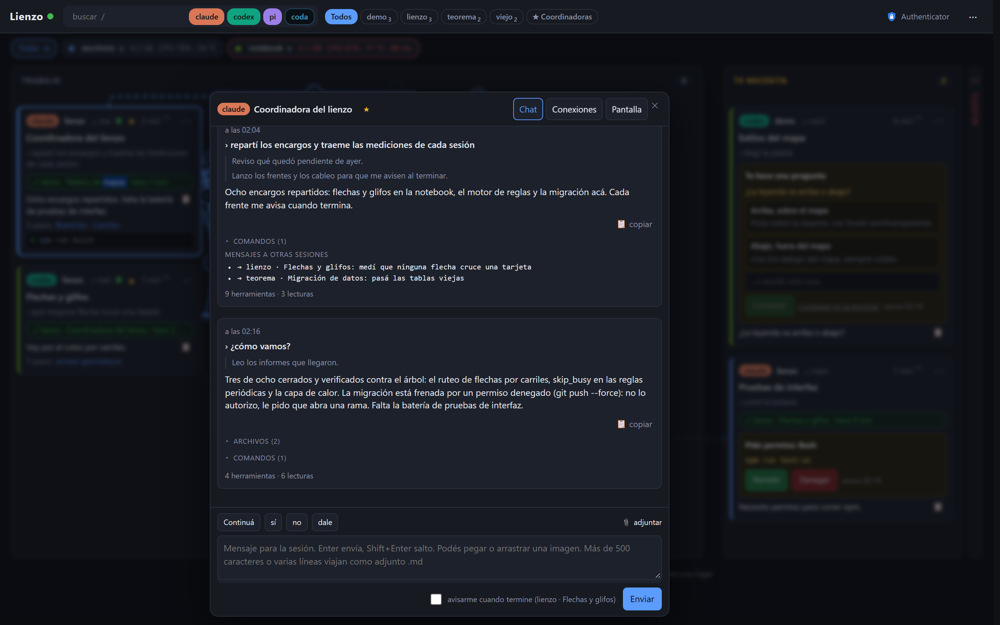
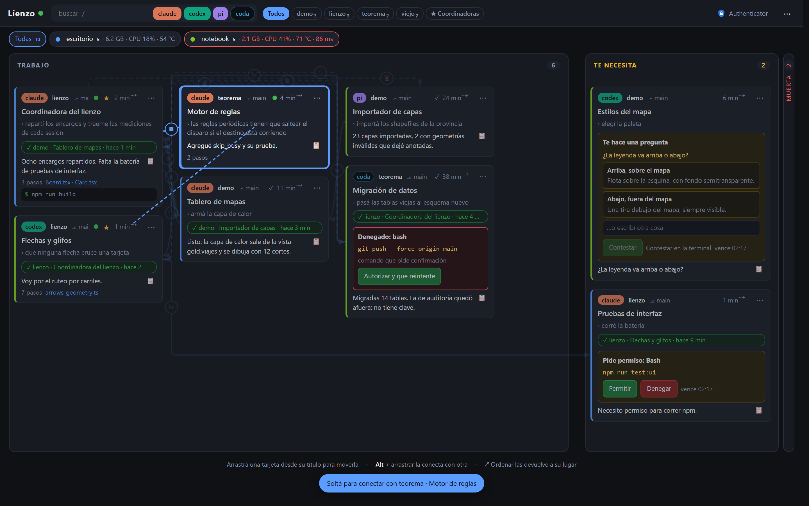
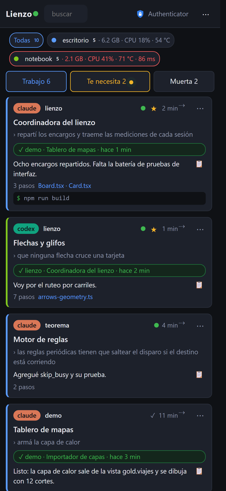

# Lienzo

Tablero para las sesiones de **Claude Code**, **Codex CLI**, **Pi CLI** y **CODA** que corren en terminales de
Windows: la integrada de VS Code, Windows Terminal, una PowerShell o un cmd sueltos. Una
tarjeta por sesión, agrupadas por columna (trabajo, te necesita, muerta), con la
conversación a un click, una caja para contestarles, **aprobación de permisos sin ir a la
terminal**, capturas pegadas con Ctrl+V y conexiones entre sesiones.

Corre local, en `127.0.0.1:7321`. El acceso desde el celular es opcional y no hace falta
instalar nada para usarlo en la propia PC.

No hospeda terminales ni guarda historial propio: es un monitor con derecho a contestar.

Las apps de escritorio de Claude y de Codex no tienen consola: sus sesiones se pueden ver
(si disparan hooks) pero no se les puede escribir desde acá.


## Cómo funciona

Al arrancar, y después cada 30 segundos, el server **recorre los procesos de la PC** y
encuentra todas las terminales de Claude Code (`claude.exe`), Codex CLI (`codex.exe`), Pi CLI y CODA (`coda.exe`) que
estén corriendo, aunque se hayan abierto antes de instalar nada: lee el directorio de
trabajo de cada proceso, ubica su transcripción y arma la tarjeta. Descarta las apps de
escritorio y las extensiones de VS Code, que usan los mismos nombres de ejecutable.

Pi se detecta por su ejecutable o por Node ejecutando el CLI oficial; no se incluyen los
modos RPC, print ni JSON. Su extensión publica el PID y la ruta exacta de la sesión. Para las TUIs ya abiertas sin
extensión, el backend también lee `PI_SESSION_ID`/`PI_SESSION_FILE` de sus shells hijos y
valida la cabecera del JSONL. Si no encuentra un shell y hay una sola Pi en ese proyecto,
busca el JSONL con actividad más reciente posterior al arranque del proceso y verifica su
`cwd` e ID: también contempla sesiones reanudadas. Ese respaldo es heurístico; con varias
Pi en el mismo proyecto exige identidad exacta. La vinculación queda guardada en la tarjeta.

En CODA la sesión de cada proceso se identifica sin adivinar por carpeta ni por fecha. Quedan
afuera las corridas headless y los subcomandos.

Después, estos canales, cada uno por su lado:

| Qué | Cómo |
|---|---|
| Estado de cada sesión | Hooks de los propios agentes (`SessionStart`, `UserPromptSubmit`, `Stop`, `PermissionRequest`…) que escriben un archivo en `~/.lienzo/events`. Nunca se raspa la pantalla para esto. |
| Contenido | Las transcripciones `.jsonl` que Claude Code, Codex y Pi ya escriben en disco; en Pi se sigue la rama activa. Se leen por la cola, nunca enteras. En CODA, su base local de sesiones, en solo lectura. |
| Mandar un mensaje | Inyección de teclas en la consola del proceso por PID (`AttachConsole` + `WriteConsoleInputW`). Funciona sin foco y aunque la pestaña esté oculta. Los adjuntos viajan como ruta en el texto. |
| Contestar un permiso | El hook `PermissionRequest` es sincrónico: deja el pedido en una carpeta y espera hasta 60 s la respuesta que el tablero escribe. Si nadie contesta, el prompt aparece en la terminal como siempre. |
| Contestar un permiso de CODA | Permitir y Denegar se teclean en su diálogo, después de confirmar en la pantalla que sigue abierto. |
| Contestar una pregunta | El mismo hook: `AskUserQuestion` pide permiso como cualquier herramienta. La opción elegida vuelve adentro del `updatedInput` de la decisión, que es donde la deja el menú de la consola. |

Además: conexiones entre sesiones (reenvío ahora, cuando termine, programado a una hora o
cada tanto con tope, canal nativo Claude a Claude), flechas entre las tarjetas por cada
conexión, y una pestaña que muestra el texto visible de la terminal leído del buffer de consola.

Cuando una consola cambia de `session_id` sin cambiar de proceso (un `/clear` o un resume
en Claude Code), la tarjeta nueva hereda el PID de la vieja y todas las conexiones que la
apuntaban: las reglas "cuando termine" y el historial de envíos pasan a la sesión nueva y
la vieja se da de baja. Una prueba manual del hook con un `session_id` inventado y el PID
de una sesión viva no la reemplaza.



## Requisitos

- Windows 10/11: es donde está probado de punta a punta. Mac, Linux y WSL van por tmux (ver abajo).
- Python 3.14 o más nuevo, sólo biblioteca estándar. Sin `psutil`, sin frameworks.
- Node 24 LTS para compilar la interfaz (Vite + React + TypeScript).
- Claude Code 2.1+, Codex CLI 0.153+, Pi CLI (integración desarrollada contra 0.86.0) o CODA.
- Sólo para el acceso desde el celular, y sólo si lo querés: `cloudflared`
  (`winget install Cloudflare.cloudflared`). Para usarlo local no hace falta.

### Mac, Linux y WSL: con tmux

El núcleo no depende del sistema operativo: el estado sale de los hooks de los propios agentes y
el contenido, de las transcripciones `.jsonl`. Lo atado a Win32 son dos archivos: `send.py`
(escribir en la consola de otro proceso, `AttachConsole` + `WriteConsoleInputW`) y `screen.py`
(leer su buffer, `ReadConsoleOutputCharacterW`).

Fuera de Windows esas dos piezas van por tmux: `tmux send-keys -t <pane>` en vez de attachearse a
la consola ajena y `tmux capture-pane -p` en vez de leer el buffer, y el direccionamiento es por
pane en vez de por PID (`lienzo/tmux.py`, descubrimiento por `ps`, no `/proc`). La fuente es
**múltiple** (`lienzo/backend.py`): un tablero en Windows ve también los agentes de WSL, los maneja
por `wsl.exe` y les lee la transcripción por `\\wsl.localhost`. El detalle, lo verificado y lo que
falta están en `docs/porting-linux-2026-09-08.md`.

**La limitación de fondo: para escribirle a un agente, tiene que haber arrancado adentro de tmux.**
No es de lienzo sino de Unix:

- **Leer** un agente (su conversación, su estado) **no necesita tmux**: sale del proceso (`ps`), su
  cwd y su transcripción `.jsonl`. Un claude/codex que abrís normal en una terminal aparece en el
  tablero **en solo lectura** ("sin consola").
- **Escribirle** sí necesita tmux. En Unix un PTY es de quien lo creó: no hay forma soportada de que
  otro proceso le teclee a una terminal ajena que ya corre (en Windows sí, con `AttachConsole`).
  tmux es lo que da ese acceso, y por eso el agente tiene que **nacer** adentro.

Por eso `POST /sessions/launch` (también el pedido desde otra PC) en Mac/Linux/WSL abre
la sesión con `tmux new-session -d`, nunca en una terminal suelta. El server se arranca con
`./lienzo-server.sh`, que exige Python 3.14 igual que en Windows. Probado: un tablero de Windows
leyendo y escribiéndole a agentes en tmux de WSL. Sin probar todavía: el server corriendo nativo en
Linux, el emparejamiento entre PCs desde Linux, `install.py` fuera de Windows (sin hooks, las
tarjetas salen del barrido) y un Mac. Pi y CODA, por ahora, solo en Windows.

Para que un agente sea escribible desde el board, arrancalo en tmux. El helper lo esconde en un
comando:

```bash
./lienzo-new.sh claude          # (o codex, o: ./lienzo-new.sh claude mirepo)
# Ctrl+b, d  para salir sin cerrarlo ; tmux attach -t <nombre>  para volver
```

#### TIOCSTI: escribirle a un agente suelto sin tmux (apagado por seguridad)

El único mecanismo para inyectarle entrada a una terminal ajena sin tmux es el ioctl **`TIOCSTI`**.
Lo **desactivaron por defecto** en los kernels modernos (CVE-2017-5226: cualquier proceso podía
inyectar comandos en cualquier terminal del usuario). Si alguien lo quiere habilitar —su máquina,
su decisión— es un `sysctl`:

```bash
cat /proc/sys/dev/tty/legacy_tiocsti          # 0 = apagado (lo normal)
sudo sysctl -w dev.tty.legacy_tiocsti=1        # prenderlo (o en /etc/sysctl.d para que persista)
```

Prenderlo **baja una defensa** (vuelve a permitir que cualquier proceso local teclee en tus
terminales). Con eso prendido se podría escribir a agentes sueltos como en Windows, pero el camino
**seguro** es tmux: no inyecta desde afuera, sino que uno es dueño del PTY desde el arranque (que es
justo lo que recomendaron los del kernel al sacar TIOCSTI). Lienzo, por ahora, **no** usa TIOCSTI.

## Instalación

```powershell
git clone https://github.com/arielelevy/lienzo
cd lienzo\web
npm install
npm run build
cd ..
py -3.14 install.py        # registra hooks de Claude/Codex/CODA y la extensión Pi
.\lienzo-server.cmd        # http://127.0.0.1:7321
```

`install.py` hace merge, no pisa la configuración que ya tengas. `python install.py --uninstall`
saca los hooks. El estado vive en `%USERPROFILE%\.lienzo\` (eventos, permisos pendientes,
adjuntos, tarjetas); no toca AppData.

**Reinicio explícito.** Después de un `git pull` el server sigue con el código viejo hasta que se
lo reinicia: `POST /restart` (o `coordinar.reiniciar()`; con `pc`, reinicia la otra PC). El server
comprueba que el código nuevo compile, sale con el código 75 y `lienzo-server.cmd` lo relanza en la
misma ventana; si algo no compila, contesta 409 y sigue andando con lo viejo. Antes se recargaba
solo al cambiar cualquier `.py`, pero eso lo reiniciaba en medio del trabajo de los agentes (503,
capturas y pruebas cortadas); quien lo quiera igual pone `"auto_reload": true` en `config.json`.
Sin el `.cmd` no hay reinicio: salir apagaría el server.

Codex pide confiar cada hook la primera vez que abre una sesión con `hooks.json` nuevo.

### Pi CLI

`py -3.14 install.py --pi-only` registra `extensions/pi-lienzo.ts` en
`~/.pi/agent/settings.json`, conservando la configuración y guardando un backup. Respeta
`PI_CODING_AGENT_DIR` si está definido. Abrí una sesión nueva o ejecutá `/reload` en Pi
para cargarla; si el servidor ya estaba abierto, debe reiniciarse de forma coordinada para
cargar el backend nuevo.

Pi participa del envío, reenvío y copiar/pegar trabajo con Claude y Codex en ambos sentidos.
El canal nativo sigue siendo exclusivo de Claude a Claude. Los diálogos de extensiones Pi
se contestan en su terminal: mientras están abiertos se bloquea la inyección de mensajes.
El reenvío «cuando termine» espera `agent_settled`, no una respuesta intermedia ni
`agent_end`, para no adelantarse a reintentos o mensajes encolados. La lectura de logs
sin extensión muestra la conversación y un estado inferido, pero no dispara esos reenvíos
ni reintentos automáticos: para eso hay que cargar la extensión con `/reload`.

La validación automatizada cubre parsers, eventos y transporte simulado. La recepción real
por `WriteConsoleInputW` entre las tres TUIs requiere una prueba con terminales de prueba;
no se debe usar una sesión de trabajo activa para ese ensayo.

### CODA

`py -3.14 install.py --coda-only` registra los hooks del lienzo en `~/.coda/config.json`, con
backup y sin tocar el resto de la configuración. Respeta `CODA_HOME`. En las sesiones ya
abiertas, `/reload-hooks`.

La tarjeta muestra la conversación, lo que la sesión va haciendo (herramienta, comando y
archivos) y el trabajo de sus subagentes. Sin hooks aparece igual, por el barrido, con menos
detalle: cuántas herramientas lleva y cuál corre.

Cuando CODA pide permiso, la tarjeta pasa a «te necesita» y ofrece Permitir y Denegar, que se
teclean en su terminal después de confirmar en la pantalla que el diálogo sigue abierto.

## Uso

### Tablero

Tres columnas: **Trabajo** (corriendo y terminó), **Te necesita** y **Muerta**. Una columna sin
tarjetas se colapsa a una tira vertical: click en la tira la abre, click en el título la cierra.
Cuando hay lugar, las tarjetas se reparten en hasta cuatro subcolumnas.

Una sesión pasa a *Te necesita* cuando pide permiso, cuando te hace una pregunta con opciones,
cuando su respuesta termina con una pregunta para vos, o cuando está libre sin ningún pedido. Un informe entregado sin pregunta la deja en
*Trabajo*.

`/` enfoca el buscador (agente, repo, rama, título, último pedido) y los chips filtran por agente.
Un click en una tarjeta **la elige**: se resaltan sus flechas y sus conexiones se leen en palabras
("Al terminar le manda su respuesta a lienzo · Coordinadora. Van 4 de 20."). El **doble click abre
el panel**. Esc cierra de a una capa: primero el panel, después la elección. Todo se alcanza con
el teclado: Tab recorre las tarjetas y las flechas los controles de la que tenga el foco.

### Correr las tarjetas

El lugar de cada tarjeta lo decide el estado de su sesión, pero se puede mover: **arrastrala desde
su fila de arriba o su título** y queda donde la sueltes. Las demás cierran el hueco y siguen
acomodándose solas; la corrida no cambia de columna ni de estado, y se queda ahí aunque pase a *Te
necesita* (el borde avisa igual). Esc a mitad del arrastre la devuelve.

En cuanto hay alguna corrida aparece **⤢ Ordenar** arriba a la derecha del tablero: las devuelve a
todas al orden automático. Las posiciones viven en el navegador —sobreviven al refresco, no viajan
al server ni a otra máquina— y la de una sesión que se fue se descarta sola.

Con **Alt** apretado, ese mismo arrastre conecta en vez de mover (ver *Conectar sesiones*).

### Elegir varias a la vez

**Ctrl** (o **Cmd**) más click sobre una tarjeta la suma a una *selección múltiple* o la saca; también
Ctrl+Espacio con la tarjeta enfocada. Un click simple, sin Ctrl, hace lo de siempre (elige una) y
suelta la selección. Las marcadas llevan un contorno de trazos y una tilde, distintos de la elegida.
Una tarjeta de una PC caída no se puede marcar.

Aparece entonces una **barra de selección** abajo con «N tarjetas» y cuatro botones:

- **Marcar las visibles**: marca todas las que pasan los filtros de ese momento (texto, agente, PC,
  proyecto, coordinadoras), de cualquier PC. Deja afuera las muertas y las que no reciben mensajes
  (sin consola, huérfanas, PC caída).
- **Enviar a todas**: abre una caja; manda el mismo texto a cada una, de a una, y dice «N ok / M
  fallaron» con el motivo de cada falla. Si falló alguna, la caja queda abierta para reintentar.
  Ctrl+Enter envía.
- **Interrumpir**: un Esc en la terminal de cada una (`POST /sessions/<sid>/interrupt`).
- **Limpiar**.

El mismo gesto vale en los chips de **PC** y de **proyecto**: Ctrl+click suma o saca ese chip del
filtro, así que se pueden ver varios a la vez; el click simple deja uno solo. Si se saca el último,
vuelve a *Todas* o *Todos*. Esc pela una capa por vez: la caja de envío, lo que ya había (arrastre,
ayuda, diálogo de conectar, panel), la selección múltiple y por último la tarjeta elegida.

### La tarjeta

Título (✎ para renombrarlo), último pedido, y **lo que el agente viene escribiendo en este turno**
—no el nombre de la herramienta—. Debajo, en qué anda: pasos, cuántos volvieron con error, los
últimos archivos que tocó, el último comando, los chips de sus conexiones y la sugerencia 💡 que
la terminal esté mostrando en ese momento.

La ★ marca la coordinadora del repo, una por repo: es a quien van los avisos "cuando termine". Una
sesión libre muestra un solo botón, "Darle trabajo". Si llegó al límite de uso y el aviso trae la
hora de vuelta, aparece "Continuar a las HH:MM", que deja programado el "Continuá"; si el turno se
cortó con un error de API ("The response stopped arriving"), aparece "↻ Reintentar". Con *Detalles
técnicos* apagado (menú ⋯) no se ven PID, hooks ni ids.

**Diálogos de la terminal**: los menús numerados de la TUI de Claude ("Switch model?", que abre
`/model`) no son un pedido de permiso y no disparan ningún hook: si nadie mira esa consola, la
sesión se queda esperando una tecla para siempre. El lienzo los lee de la pantalla y los muestra
en la tarjeta con sus opciones; elegir una teclea el número en su terminal.

### Contestar, aprobar, adjuntar

- **Contestarle**: la caja al pie del panel, Enter manda. Se le escribe en su terminal aunque esté
  oculta y sin robarte el foco. Más de 500 caracteres o varias líneas viajan como `.md` adjunto,
  que el agente lee por ruta. Si la terminal está mostrando una sugerencia, Tab la escribe.
- **Aprobar o denegar un permiso** sin ir a la terminal: la tarjeta muestra el comando con
  Permitir y Denegar. Nunca "permitir siempre". El pedido vence a los 60 segundos y ahí el prompt
  aparece en la terminal como siempre.
- **Permisos denegados**: lo que una regla, una política o un clasificador le niega a un agente
  (no lo que rechazás vos) aparece en su tarjeta como «Denegado: herramienta», con el comando y el
  motivo, y un botón «Autorizar y que reintente» que se lo dice al agente. Vale para Claude, Codex y
  Pi (sale de la transcripción) y para coda (sale de su log, que también avisa cuando coda propone
  una regla de permisos permanente con `propose_policy`).
- **Elegir una opción cuando la sesión te pregunta**: `AskUserQuestion` llega por el mismo hook
  que un permiso, pero no es un permiso. La tarjeta muestra la pregunta y sus opciones con la
  descripción de cada una; se toca la que va (o se escribe otra cosa) y el agente sigue, sin
  pasar por la terminal.
- **Adjuntar imágenes y archivos**: se arrastran a la caja, o **se pega una captura con Ctrl+V**
  (sube con nombre por fecha y hora). Es la forma corta de mostrarle un error de pantalla.
- **Botones rápidos** "Continuá", "sí", "no" en la tarjeta, sólo cuando la sesión de verdad está
  esperando algo.
- La casilla **"avisarme cuando termine"** convierte el envío en delegación: manda el texto y crea
  la regla "cuando termine" hacia la coordinadora. Un gesto en vez de dos.
- **Copiar y pegar trabajo entre sesiones**: con una tarjeta elegida, Ctrl+C (o "Copiar trabajo"
  en su menú ⋯) arma un encargo con el último pedido, la última respuesta y los destacados de los
  últimos cinco turnos; Ctrl+V sobre otra tarjeta (o "Pegar trabajo") abre una vista previa
  editable. Hay un solo portapapeles para todo el tablero, y no se puede pegar en la misma sesión de
  origen ni en una que está esperando un permiso. Al enviar, la tarjeta destino **hereda el título
  con la marca "copycat"** y lleva la etiqueta ⧉ copycat en su fila de arriba; por defecto la de origen
  **recibe un Esc si está corriendo y pasa a "stopped"**, para que no hagan las dos lo mismo. La
  casilla **Duplicar** deja las dos trabajando: nadie se detiene, y cuando la copia termine le
  manda su informe a la de origen una sola vez. Es una conexión de un solo sentido a propósito:
  la ida y vuelta es el bucle A↔B que el server rechaza.
- **La llave "stopped"**: la etiqueta roja en la fila de arriba de la tarjeta. Prendida, la sesión
  **no recibe nada**: los envíos desde el tablero rebotan, las reglas "cuando termine" y las
  periódicas que la apuntan se saltean sin gastar el disparo, y no se le puede pegar trabajo. Al
  prenderse, el lienzo **avisa por su terminal a la coordinadora del repo y a toda sesión que
  tenga una conexión vigente con ella**, con el motivo (a qué copia se fue el trabajo, o que la
  detuvieron desde el tablero), para que no le manden nada ni cuenten con sus conexiones. Se
  prende desde el menú ⋯ ("Detener") o al pegar su trabajo en otra tarjeta; se apaga con un click
  en la etiqueta, desde el menú ("Habilitar"), o sola cuando llega un pedido nuevo por su terminal.

Las tres pestañas del panel: *Chat* (por turno: pedido, lo que fue diciendo, respuesta,
archivos, comandos, errores, preguntas), *Pantalla* (el buffer de la terminal) y *Conexiones* (lo
que recibió, lo que mandó y las conexiones activas).

### Conectar sesiones

Arrastrá una tarjeta **desde el agarre ⇢**, o con **Alt** apretado desde su fila de arriba o su
título, y soltala sobre otra. (Sin Alt, ese mismo arrastre **mueve** la tarjeta: ver *Correr las
tarjetas*.) Se escribe en una frase, que se interpreta mientras tipeás: "continuá a
las 16:00", "en 30 min seguí", "cada 30 min continuá hasta 6 veces", "cuando termine mandale a
demo", "cuando termine avisame". Enter confirma. Soltarla **sobre sí misma** es el bucle.

Cuatro modos: *Ahora* (le manda la última respuesta de la otra, con plantilla editable), *Cuando
termine* (su respuesta viaja al cerrar cada turno, una vez o hasta un tope), *Programar* (un texto
a una hora, o cada tanto con tope, y opcionalmente sólo si el destino está libre) y *Canal nativo*
sólo entre sesiones de Claude, que se hablan con `SendMessage` y se contestan entre ellas.

Toda regla tiene tope, y el server rechaza el bucle A↔B, la regla repetida y dos programadas al
mismo minuto hacia la misma sesión.

### Flechas

Cada conexión se dibuja entre las tarjetas: el último envío con ↪ (×N si hubo varios), las reglas
pendientes punteadas con ⏹, ⏰ o ↻, el canal nativo con una flecha doble. **La flecha de un envío
vive diez minutos** y después se va sola: el tablero muestra lo que está pasando ahora, y lo
mandado queda en la pestaña Conexiones. Un click en el glifo elige la flecha y explica qué hace;
el doble click abre el editor de la regla o los mensajes de ese par; Quitar vive adentro, con
confirmación. Un botón del menú las oculta, y en pantallas de menos de 900 px no se dibujan.

### Las automatizaciones

Viven en el menú ⋯ y vienen apagadas. Son lo único que corre sin que hagas nada.

- **Continuar solo tras límite de uso**: cuando una sesión avisa que llegó al límite con hora de
  vuelta, deja programada la regla "Continuar" un minuto después. Si borrás la regla, no la vuelve
  a crear.
- **Reintentar solo tras un error de API**: cuando un turno muere con "API Error: The response
  stopped arriving" (o un timeout, o un `overloaded_error`), programa "Continuar" diez segundos
  después —tiempo de sobra para quitarla si no querés—. Un límite de uso o un problema de crédito
  no entran acá: eso no se arregla reintentando.
- **☠ Auto-aprobar TODO (peligroso)**: el check en negro. Aprueba solo, sin mirarlo, cada permiso
  que pida cualquier agente (Claude, Codex, Pi, coda) en **todas las PCs emparejadas**; no contesta
  las preguntas con opciones. Pide confirmación al prenderlo, deja una barra negra arriba con
  «Apagar» mientras está prendido, y cada aprobación queda en `lienzo.log` como AUTO-APROBADO. Se
  prende solo desde una PC de la LAN (nunca por el túnel). Si una PC no lo toma (estaba caída), la
  UI lo avisa y se le reenvía cuando vuelve. Está hecho con proveedores (`lienzo/autoaprobar.py`):
  uno por cada forma de pedir permiso (el hook de Claude/Codex/Pi y el cartel de coda).

## Delegar trabajo a varias sesiones

El flujo que le da sentido al tablero: abrís dos o tres terminales de Claude Code, y desde el
lienzo le mandás a cada una una tarea (texto largo, viaja como adjunto) con "avisarme cuando
termine" marcado. Cada consola trabaja en sus archivos, y su informe final llega solo a la
coordinadora al cerrar el turno. La coordinadora verifica, commitea y reparte la ronda
siguiente. Este repo se construyó así: la mayoría de los commits del 5 de septiembre los
hicieron otras sesiones de Claude a partir de encargos y revisiones repartidos desde el
propio lienzo, incluidos los planes de producto de `docs/plan-pm-2026-09-05.md` y
`docs/plan-pm-2026-09-06.md`, que salieron de probar el lienzo por la interfaz y repartir lo
encontrado a tres sesiones en paralelo.

Es manual a propósito: dos agentes vinculados en los dos sentidos se contestan hasta agotar
los créditos, por eso el server rechaza el bucle y cada regla tiene tope.

El método completo, escrito para que lo siga la propia coordinadora, está en el skill
[`skills/lienzo`](skills/lienzo/SKILL.md). Para que Claude Code o Codex lo carguen, copiar o
enlazar esa carpeta en `~/.claude/skills/` o `~/.agents/skills/`.




## Acceso desde el celular

**Opcional.** Para usar el lienzo en la propia PC no hace falta nada de esto: el server escucha en
`127.0.0.1:7321` y listo. El túnel es sólo si querés abrir el tablero desde afuera —tiene sentido
si el lienzo corre en una máquina que se queda trabajando en casa—.

```powershell
.\lienzo-server.cmd --remote
```

En la PC, botón **Acceso remoto**: genera una clave TOTP y muestra dos QR. El primero se
escanea desde adentro de Microsoft Authenticator (Agregar cuenta → Otra cuenta); el segundo,
con la cámara, abre el tablero en el teléfono. Desde afuera se entra con el código de 6
dígitos; en la PC no se pide login nunca.

Por debajo: túnel `cloudflared` con TLS (sin abrir puertos ni tocar el router), cookie de
sesión de 7 días, cinco intentos fallidos bloquean el login 15 minutos, y el server sólo
escucha en `127.0.0.1`. La URL del túnel rápido cambia en cada arranque; para una URL fija
hace falta un túnel con nombre y un dominio en Cloudflare.



## Varias PCs

**Opcional, hasta 4 PCs de la misma LAN.** Sin ningún peer emparejado no cambia nada: el listener
de peers ni se abre y la tira de PCs no aparece. Emparejada una, cada tablero muestra las tarjetas
de las dos (o las cuatro) y desde cualquiera se contesta, se aprueba, se conecta y se coordina.

Regla de fondo: **cada PC es dueña de lo suyo**. La inyección de teclas, la lectura de pantalla,
los hooks, los permisos y los recursos (memoria, CPU, temperatura) son siempre de la máquina donde
corre el proceso — nunca se replican, se le piden a la PC dueña por la red. `GET /sessions` mezcla
lo local con lo espejado de las demás PCs de forma transparente, y `/sessions/<sid>/send`,
`/interrupt`, `/dialog`, `/pending/<id>`, `/attach` y `DELETE` funcionan igual sea la sesión local o
remota: si la tarjeta es de otra PC, el server reenvía el pedido y devuelve la respuesta tal cual
(**503** `{"error": "sin conexión con <pc>"}` si esa PC no contesta). El 503 suma `"no_llego": true`
solo cuando el pedido no salió (PC desconocida o conexión rechazada) y se puede reintentar; sin esa
marca (timeout, corte a mitad) pudo haberse ejecutado del otro lado.

### Emparejar

**🖥 Varias PCs**, en el menú ⋯: una PC ofrece una palabra (de la lista EFF), la otra la pega
dentro de los 5 minutos. La clave del par **no sale de la palabra**: sale de un intercambio SPAKE2
(Diffie-Hellman sobre el grupo MODP de 2048 bits, cegado con la palabra), así que quien escucha la
red no aprende nada y quien se hace pasar por la otra PC tiene un solo intento. Una palabra mal
tipeada se gasta (hay que generar otra) y cinco errores bloquean el emparejamiento 15 minutos. La
clave queda en `peers.json` de las dos puntas; **tope de 4 peers**. Las dos PCs tienen que tener
la misma versión para emparejarse (una vieja contesta «formato viejo»). La misma pantalla lista los peers y los
revoca; revocar corta el espejo y lo saca de `peers.json`, y del otro lado se entera cuando deja
de contestarle.

**Todas las PCs de la LAN con el lienzo andando se ven solas**, emparejadas o no: un **beacon UDP**
(puerto 7323) anuncia cada 10 s el nombre, el `pc_id` y el puerto de cada PC, sin firma. La pantalla
lista las que ve en **En esta red** al abrirse (sin sondeo; para buscar de nuevo, `GET /peers/lan`),
y **Emparejar** deja puestos la IP y el puerto: falta sólo la frase. Ese anuncio no da ningún
permiso; hablarle a una PC sigue pidiendo la clave del par. A los ya emparejados, además, el beacon
les manda un anuncio firmado con la clave de cada par: si el DHCP le cambió la IP a una PC, se
actualiza sola sin tocar nada a mano.

### Red y firewall

El tablero sigue en `127.0.0.1:7321`, sin cambios. Un **listener aparte** (7322 por defecto,
`--peer-port` para cambiarlo) atiende sólo `/peer/*`, bind a la IP de LAN de la PC —nunca
`0.0.0.0`— y firma cada request con HMAC (`X-Lienzo-Peer`, `X-Lienzo-Ts`, `X-Lienzo-Nonce`,
`X-Lienzo-Sig`, ventana de ±30 s, sin nonces repetidos): un peer emparejado puede teclear en la otra
PC y lanzar sesiones nuevas, así que la firma y la ventana de tiempo son las que evitan que
cualquiera en la LAN se haga pasar por un peer. `lienzo-server.cmd` lo arranca siempre (pasa
`--peers`); corriendo `server.py` a mano, sólo con `--peers` o con algún peer ya emparejado. En una
red pública no llega nadie: el firewall lo abre sólo en el perfil Privado.

```powershell
py -3.14 install.py --peer          # regla de firewall de Windows, 7322 TCP y 7323 UDP, perfil Privado
py -3.14 install.py --peer --uninstall
py -3.14 install.py --peer --dry-run   # imprime lo que haría, sin escribir nada (no pide admin)
```

Sin permisos de administrador, `--peer` avisa claro y no toca nada.

### Lanzar una sesión en otra PC

Desde la ★ (coordinadora): `POST /sessions/launch {pc, cwd, agent, title}`. Si `pc` es la propia (o
no viene), lanza local; si es otra, el pedido viaja por `/peer/launch` y la PC dueña escribe el
`.cmd` (cp1252, CRLF, `cd /d`, título saneado, ejecutable por ruta absoluta) y lo abre con
`explorer.exe`, igual que hace el skill hoy en la propia máquina. Restringido a `launch_roots`
(nuevo, en `config.json` de esa PC: una lista de carpetas; vacía o ausente es **ninguna**, no
todas) y a los cuatro ejecutables conocidos (`claude`, `codex`, `pi`, `coda`); el título nunca se
interpreta como comando. La tarjeta nueva aparece después de un barrido, como cualquier sesión
recién abierta.

**Elegir el modelo.** `model` en el mismo pedido agrega `--model <id>` al comando de `coda`, `claude`
y `codex` (por ejemplo `globant_dgx/GLM-5.3-Flash`). El id va escrito en la línea del `.cmd`, así
que solo pasa con `[A-Za-z0-9._/:@-]` y hasta 80 caracteres; la respuesta trae `model_applied`
(falso si el agente no lo soporta o el id no es válido: ahí se lanza con el modelo por defecto).
`pi` no lo recibe. **Ojo con coda:** su `--model` no vale solo para esa sesión, cambia el modelo por
defecto de esa PC (queda escrito en su `config.json`), así que las sesiones que se lancen después
«sin modelo» usan el nuevo. Avisale a quien use esa PC, y si hace falta volver al anterior, lanzá con
el `model` de antes.

### Cablear entre PCs

Una regla «cuando termine» (`POST /rules {kind: "on_stop", from, to, text}`) puede unir tarjetas
de PCs distintas, y es la forma de que una coordinadora se entere sola de lo que hacen los frentes
de otra máquina, sin consultarlos de a uno.

- **La regla vive en la PC del origen**, que es donde ocurre el Stop. Si `from` es de otra PC, el
  pedido se reenvía a su `/peer/rules` y se crea allá; si esa PC tiene un lienzo viejo que no sabe
  hacerlo, la respuesta es 502 y dice que hace falta `git pull`. Cuando termina el origen, esa PC le
  escribe el aviso a la tarjeta de destino, que está en la otra (el envío ya se enruta solo).
- **`GET /rules` incluye las de las demás PCs** (con su `pc`), y `DELETE /rules/<id>` de una regla
  que vive en otra PC se reenvía a su dueña.
- **Sobreviven al reinicio.** Las que tienen el destino en otra PC se marcan `xpc`; al arrancar, el
  espejo todavía está vacío y antes se descartaban por «destino desconocido». Ahora se conservan, y
  un lazo las limpia solo cuando todos los peers ya mandaron su estado y el destino de verdad no
  existe más.
- **Una tarjeta que cambia de id no pierde sus reglas.** Un agente recién lanzado nace como
  `pid-NNN`; cuando sus hooks se enganchan, pasa a su `session_id` real y las reglas y los links que
  nombraban a la provisoria pasan a la real.

El skill lo resume en `coordinar.cablear()`: una regla por cada frente vivo hacia la coordinadora.

### Restaurar sesiones tras un reinicio

Si una PC se reinicia, mueren todos sus agentes y antes la tarjeta se borraba a los 60 s sin dejar
registro. Ahora cada PC guarda en `~/.lienzo/restaurar.json` lo que hace falta para relanzarlos:
agente, carpeta, título y `session_id`. Se escribe al borrar una tarjeta muerta, al arrancar el server
y en el barrido de liveness (con un debounce de 30 s por sesión), de modo que un reinicio brusco
también deja registro. **Lo que se cerró a propósito no se guarda**: `/exit`, `logout`, `clear`,
`resume`. Se poda a los 7 días y el tope es de 200 entradas.

- `GET /restaurables`: las de esta PC y las de cada peer vivo, con su `pc`.
- `POST /restaurar {session_id | all: true, pc?, limit_by_memory?}`: relanza desde su carpeta
  retomando la conversación (`claude --resume <id>`, `codex resume <id>`, `pi --resume`,
  `coda --lastsession`). Es la PC dueña la que lanza, de a una y con 2 s entre cada una. Con `all`
  se mira la memoria libre: entran `(libre − 1.5 GB) ÷ 0.7 GB` sesiones; si no entran todas, 409 con
  cuántas sí, y con `limit_by_memory: true` relanza solo esas. Una segunda restauración al mismo
  tiempo da 409.

Por ahora se usa por la API y por el skill (`coordinar.restaurables()` y `coordinar.restaurar()`);
todavía no tiene botón en el tablero.

### La tira de PCs y los chips de proyecto

Con dos o más PCs emparejadas aparece, arriba del tablero, un chip **Todas** con el total y uno por
PC con su nombre, cuántas tarjetas tiene ahí y —si está viva— memoria libre, CPU, temperatura y
la latencia de los pedidos a esa PC (`GET /peers`); el conteo va en subíndice chico, para que no se
lea como parte del nombre. **El chip se pone en rojo**, con el motivo al pasar el mouse, si la PC
pasa de 85 °C, si no le entra otro agente sin bajar de 1,5 GB libres, o si algún agente se quedó sin
cuota (coda por su log y su base, sin gastar tokens, y solo si hay una coda viva en esa PC o la hubo
en la última hora; Claude, Codex y Pi por el límite de uso que avisan sus tarjetas). **La credencial de git va aparte, en violeta**, con el motivo, el host y el
repo: cada PC prueba con `git ls-remote` (sin abrir ventanas de login) el remote `origin` https de
cada repo donde tiene una sesión viva (hasta una hora después de cerrar la última: un proyecto que
ya no usás deja de aparecer solo), más las urls fijas de la clave `git_check` de su `config.json`
(para vigilar un repo sin sesión abierta), y distingue `vencida` (la credencial, 401/403: se arregla con
`coordinar.pasar_credencial_git`), `sin red` (no llega al host), `timeout` (git no terminó) y
`error`. La temperatura sale de LibreHardwareMonitor si está corriendo, o
de la zona térmica de Windows que haya. Click
filtra a esa PC y nada más (Ctrl+click suma otra al filtro, ver *Elegir varias a la vez*): se
vuelve con Todas. Una PC caída se ve en ○, sin
memoria ni temperatura (sería un dato viejo), y sus tarjetas quedan grises con controles
deshabilitados y "sin conexión hace X".


Al lado, con dos o más proyectos en el tablero, un chip por repo (con sesiones vivas) más
**★ Coordinadoras**, en el header al lado del buscador. **El click elige y nada más**: un proyecto
por vez (con Ctrl+click se suman más), otro click sobre el elegido no lo suelta, y **Todos** vuelve a todo. ★ Coordinadoras es la
excepción, se prende y se apaga, y se combina con lo elegido: muestra las coordinadoras de ese
proyecto, o de todos si no hay ninguno elegido. Los dos
filtros, el de PC y el de proyecto, viven en el navegador (como las posiciones corridas): no viajan
al server ni a otra máquina.

### La coordinadora, entre PCs

Por defecto hay **una ★ por repo en toda la federación**, esté la sesión en la PC que esté:
`PUT /sessions/<sid>/coordinator {on: true}` prendida en una apaga cualquier otra del mismo repo,
sea local o remota. `{on: true, scope: "pc"}` la separa **sólo para esa PC**: convive con la
federada de otro lado, y las reglas de esa PC pasan a apuntarle a ella. Útil cuando cada PC prefiere
manejar sus propios avisos "cuando termine" sin que crucen la red.

### El canal nativo no cruza PCs

`ListAgents`/`SendMessage` (Claude hablándole a Claude, sin pasar por el lienzo) siguen siendo de
una sola máquina: no hay forma de mapear un nombre nativo (`app-1c`) a una sesión de otra PC. El
tablero no ofrece la flecha doble entre tarjetas de PCs distintas.

### Secretos entre PCs

Un token nunca se pega en un mensaje: quedaría en claro en los adjuntos y en los transcripts.
`coordinar.pasar_credencial_git(pc, url)` copia a otra PC la credencial de git que esta ya tiene
guardada: viaja cifrada con la clave del par y la otra la guarda en su almacén de Windows, sin que
ningún agente la vea. Para otro secreto, `coordinar.enviar_secreto(pc, nombre, valor)` lo deja 10
minutos en memoria y `coordinar.leer_secreto(id, pc=pc)` lo lee una sola vez, desde cualquier PC de
la LAN. Nunca va a un log, un adjunto ni una respuesta.

### Copiar archivos entre PCs

`POST /xfer {pc, origen, destino}` (o `coordinar.copiar` desde el skill) copia un archivo o una
carpeta de esta PC a la carpeta `destino` de otra PC emparejada, por el mismo listener de peers: sin
SMB, sin un puerto nuevo y sin otra credencial. Es un `robocopy /Z /MT` hecho en casa:

- **Por bloques y retomable.** Un archivo grande viaja en bloques de 8 MiB, cada uno su propio pedido
  firmado (HMAC de la clave del par, ventana de ±30 s, nonce), así que la firma de siempre alcanza.
  El que recibe escribe a `<archivo>.parte` y anota en `<archivo>.parte.diario` cada bloque que llegó
  y verificó. Un corte de red, un reinicio del server o de la PC retoman desde el diario. El que
  manda guarda su avance en `~/.lienzo/xfer/trabajos/`: al reiniciar, las copias que andaban siguen
  solas, a mitad del árbol, sin volver a leer lo ya verificado.
- **Paralelo.** Varios bloques en vuelo (6 hilos por defecto, `hilos`) y, para los archivos de menos
  de 1 MiB, paquetes de hasta 256 archivos u 8 MiB por pedido, varios a la vez.
- **Verificado.** sha256 por bloque al llegar (en esta CPU, con SHA-NI, sha256 hace 1,5 GB/s y
  blake2b 0,56). Al cerrar, el que recibe relee el `.parte` entero, lo compara bloque a bloque con la
  lista del que manda, y recién ahí lo renombra al nombre bueno: nunca queda un archivo a medias con
  ese nombre. Un bloque que llega distinto se rechaza (422) y se vuelve a mandar. Un archivo que
  cambia en el origen mientras viaja se detecta (tamaño o fecha) y se vuelve a pasar, sólo lo distinto.
- **Sólo lo que cambió.** Si el destino ya tiene el archivo, se comparan los hashes por bloque y
  viajan sólo los distintos; tamaño y fecha iguales no alcanzan para saltearlo. Para no releer GB en
  cada pasada, el destino guarda los hashes de lo que ya tiene en `~/.lienzo/xfer/hashes.db`, válidos
  mientras no cambien el tamaño ni la fecha de ese archivo.
- **Nunca borra en el destino**, salvo `espejo: true`: ahí frena en `confirmar_espejo` con la lista
  `borraria`, y borra sólo después de `POST /xfer/<id>/confirmar`.
- **No mata la máquina.** Topes `mbps` (red) y `disco_mbps` (lectura), hilos en modo segundo plano
  de Windows (CPU, disco y memoria con prioridad baja), y freno si cualquiera de las dos PCs baja de
  1,5 GB libres, la misma reserva de `agentes_libres`. Frenada no es error: sigue cuando se libera.
- **Rutas permitidas.** Origen y destino tienen que caer en `copy_roots` del `config.json` de su PC
  (vacía o ausente es ninguna, como `launch_roots`). Se lee en cada pedido: no hace falta reiniciar.

```json
"copy_roots": ["\\\\wsl.localhost\\Ubuntu\\home\\yo\\.cache\\volcado", "C:\\datos\\salida"]
```

**WSL.** Las rutas van como `\\wsl.localhost\<distro>\...` y el server, que corre en Windows, las lee
y escribe por 9p. Medido en la PC de Ariel: 149 MB/s leyendo un archivo de 2 GB (más que una LAN
gigabit), pero sólo ~600 archivos/s con 16 hilos leyendo archivos de 50 KB. Para un volcado de pocos
archivos grandes sirve tal cual; miles de archivos chicos dentro de WSL rinden mucho menos.

### Seguridad, en criollo

Con esto, un peer emparejado puede teclear en los agentes de la otra PC y lanzar sesiones nuevas:
mismo nivel de riesgo que el acceso remoto de arriba, mitigado igual —listener aparte que sólo
atiende `/peer/*`, bind a la IP de LAN (nunca `0.0.0.0`), firewall sólo en perfil Privado, toda
request firmada con ventana y nonce, `launch` restringido a `launch_roots` y a ejecutables fijos,
peers revocables, tope de 4—. La clave del par sale de SPAKE2 (ver *Emparejar*): capturar tráfico
no sirve para adivinarla. Un pedido sin firma de una PC emparejada recibe 401 sin que se lea el
cuerpo, y el motivo de cada 401 (reloj corrido, nonce repetido, firma) queda en el log. Ojo:
**con auto-aprobar prendido, una PC emparejada puede ejecutar comandos en las otras**: prendelo
sabiendo eso. Cada request de un peer queda en `lienzo.log` con la etiqueta `peer`.

## API

Todo en `http://127.0.0.1:7321`, JSON. Las escrituras exigen el header `X-Lienzo: 1`; por el
túnel, además la cookie de sesión.

| Método | Ruta | Qué hace |
|---|---|---|
| GET | `/sessions` | todas las tarjetas, con `alive` recalculado; con algún peer emparejado, suma las espejadas de las demás PCs (`pc`, `repo_key`, `transcript_bytes`, `model`) |
| GET | `/sessions/<sid>/turns?n=10` | turnos completos de la transcripción, con las herramientas (el tablero ya no los muestra: la pestaña Chat usa `digest`) |
| GET | `/sessions/<sid>/digest?n=10` | destacados por turno |
| GET | `/sessions/<sid>/screen` | texto visible de la terminal |
| GET | `/sessions/<sid>/connections` | links y reglas donde esa sesión es origen o destino, con la otra punta resuelta a `{session_id, name}`; lo que mandó el usuario viene como "vos (lienzo)" |
| POST | `/sessions/<sid>/send` | `{text, attachments}`; con `from` y `link_to` registra el envío entre sesiones, con `native` lo marca como canal nativo. Con `from` y `copycat: true` es "pegar trabajo": la tarjeta hereda el título con la marca copycat (`copycat_of`) y, salvo `stop_origin: false`, la de origen recibe un Esc si corre y queda `stopped_by`; la respuesta trae `interrupted` |
| POST | `/sessions/<sid>/interrupt` | un Esc en su terminal: corta el turno que corre. 409 si la sesión no está corriendo (en una quieta el Esc borra la caja) |
| POST | `/sessions/<sid>/dialog` | `{choice: n}`; elige una opción del diálogo de la TUI que la tarjeta está mostrando (se teclea el número, sin Enter). 409 si esa sesión no está mostrando esa opción |
| POST | `/sessions/<sid>/approve` | `{decision: allow\|deny, expect?}`; contesta el permiso que coda muestra en su terminal (Enter o Esc). Con `expect` (sha256 del comando visible) solo teclea si la pantalla sigue mostrando ese comando: si cambió, 409 `expect_mismatch` |
| POST | `/sessions/<sid>/attach` | sube un archivo (header `X-Filename`), devuelve la ruta |
| PUT | `/sessions/<sid>/title` | `{title}`; el título pasa a ser del usuario y no se recalcula |
| PUT | `/sessions/<sid>/stopped` | `{on: true\|false}`; la llave. Prender: Esc si corre, `stopped_by: "user"`, aviso a la coordinadora y a las conectadas por regla vigente (la respuesta trae `interrupted` y `notified`). Apagar: vuelve a recibir. Mientras está prendida, `/send`, `/dialog` e `/interrupt` devuelven 409 y las reglas hacia ella se saltean |
| PUT | `/sessions/<sid>/coordinator` | `{on: true\|false, scope?: "pc"}`; una coordinadora por repo en toda la federación, prender una apaga la anterior; `scope: "pc"` la separa sólo para esta PC |
| DELETE | `/sessions/<sid>` | saca la tarjeta |
| GET | `/peers` | la propia PC primero (`local: true`) y después cada peer emparejado, con `alive`, `last_seen`, `latencia_ms` y `health` (memoria, CPU, temperatura, `agentes_libres`, `git_auth`, `cuotas`); sin peers, un array de un solo elemento |
| POST | `/peers/offer` | `{ttl_s?}`; genera la palabra para emparejar (SPAKE2), `{phrase, expires}` |
| POST | `/peers/join` | `{phrase, host, port}`; pega la frase del otro lado. 400 si no vale, 409 con tope de 4 ya emparejados |
| GET | `/peers/lan` | las PCs de la LAN con el lienzo andando que todavía no están emparejadas, por el anuncio del beacon: `[{pc_id, name, ip, port, last_seen}]` |
| DELETE | `/peers/<pc_id>` | revoca el peer y corta el espejo |
| POST | `/sessions/launch` | `{pc?, cwd, agent, title?, model?}`; lanza una sesión nueva, local o en la PC `pc` (reenviado); `cwd` tiene que caer en `launch_roots` de esa PC; `model` agrega `--model` (coda, claude, codex) y la respuesta trae `model_applied` |
| POST | `/restart` | `{pc?}`; reinicia el server de esta PC (o de la PC `pc`): sale con 75 y `lienzo-server.cmd` lo relanza. 409 si no corre bajo el `.cmd` o si el código no compila |
| GET | `/restaurables` | las sesiones que se pueden relanzar tras un reinicio, de esta PC y de cada peer vivo (`pc`) |
| POST | `/restaurar` | `{session_id \| all: true, pc?, limit_by_memory?}`; relanza desde su carpeta retomando la conversación, de a una; 409 si `all` no entra en la memoria libre o si ya hay otra restauración en curso |
| GET | `/links` | envíos hechos; `kind` es `send`, `rule`, `native` o `user` |
| GET | `/rules` | conexiones pendientes y cumplidas, las de esta PC y las que viven en otras (con su `pc`) |
| POST | `/rules` | `{kind: on_stop\|at, from, to, text, at, repeat, max_fires}`; una `at` acepta además `every_s` (segundos, mínimo 60; periódica) y `skip_busy`; con `every_s`, `max_fires` vale 5 si no viene y `skip_busy` true; 409 si arma un bucle, si ya existe, o si una `at` cae a ±2 min de otra hacia la misma sesión (la respuesta trae `rule_id` y `replace: true`; repetir con `replace: true` en el body la reemplaza) |
| PUT | `/rules/<id>` | edita texto, hora (`at`), `repeat`, `max_fires`, y en una `at` también `every_s` (null la vuelve de un disparo) y `skip_busy`; reprogramar una `at` cumplida la reactiva |
| DELETE | `/links/<id>`, `/rules/<id>` | quita la flecha o la conexión; una regla que vive en otra PC se reenvía a su dueña |
| GET | `/pending` | permisos esperando respuesta |
| POST | `/pending/<id>` | `{decision: allow\|deny}` |
| GET | `/config` | `{auto_continue, auto_retry, auto_aprobar}` |
| PUT | `/config` | `{auto_continue?, auto_retry?, auto_aprobar?}` (booleanos); sólo esas claves, el resto de `config.json` no se toca. `auto_aprobar` solo desde la LAN y se manda a todas las PCs: la respuesta trae `peers: {pc_id: "ok" \| error}` |
| POST | `/secrets` | `{pc?, nombre, destino: git\|memoria, valor \| desde: "git_local", git_url?, usuario?}`; un secreto cifrado a esa PC. La respuesta nunca trae el valor |
| GET | `/secrets`, `/secrets/<id>?pc=` | los secretos en memoria (sin valores); leer uno lo borra. Solo desde la LAN |
| POST | `/xfer` | `{pc, origen, destino, hilos?, bs_mib?, mbps?, disco_mbps?, espejo?}`; copia un archivo o carpeta de esta PC a la carpeta `destino` de la PC `pc` (ver *Copiar archivos entre PCs*); 202 con `{id}` |
| GET | `/xfer`, `/xfer/<id>` | las copias de esta PC; una con `estado`, `pct`, `mbps`, `red_mbps`, `eta_s`, `archivos_hechos`/`archivos_total`, `salteados`, `errores`, `ultimos` (y `borraria` en modo espejo) |
| DELETE | `/xfer/<id>` | pausa la copia; lo que está en vuelo termina |
| POST | `/xfer/<id>/retomar`, `/xfer/<id>/confirmar` | sigue una copia pausada o con errores, sin rehacer lo hecho; `confirmar` deja borrar al modo espejo |
| POST | `/rules/retarget` | `{old, new}`; las reglas que avisaban a `old` pasan a `new`, en todas las PCs |
| GET | `/events` | SSE con cada cambio de sesiones, pendientes, links, reglas |
| GET | `/docs`, `/docs/README.md`, `/docs/DISENO.es.md`, `/docs/img/<x>.png` | la referencia buscable (menú ⋯ → Referencia) y los archivos que lee, tal como están en el repo |
| POST | `/rescan` | barrido de procesos ahora |
| GET | `/auth`, POST `/setup`, `/login`, `/logout`, GET `/enroll` | acceso remoto |

Todo lo de arriba es del puerto de siempre (7321, sólo `127.0.0.1`), para el tablero. Entre PCs hay
otra API, en el listener de peers (7322 por defecto): `/peer/hello` y `/peer/pair` (el
emparejamiento, sin firma) y `/peer/{snapshot,health,events}` más `/peer/sessions/<sid>/...`,
`/peer/launch`, `/peer/rules` (crear y `DELETE`), `/peer/rules/{lock,check}`, `/peer/restaurables`,
`/peer/restaurar` y `/peer/xfer/{estado,bloque,paquete,cerrar,sobrantes,borrar}` (firmados con HMAC,
ver "Varias PCs"). Ninguna la llama el navegador: son PC a PC.
Un envío, un lanzamiento o un `attach` entre PCs espera hasta 70 s (teclear en una consola tarda), y
una restauración con `all`, hasta 300 s.

## Estructura

```
lienzo/
  hook.py          hook único para los dos agentes; espera de permisos con nonce
  procinfo.py      ctypes mínimo compartido: padre, imagen, vivo, agente
  transcripts.py   lectura por la cola de las transcripciones, digest por turno, hora del límite de uso, error de API reintentable
  procs.py         liveness, barrido de procesos, cwd por PEB (Windows)
  tmux.py          la fuente de Mac/Linux/WSL: send-keys, capture-pane, panes y agentes sueltos por `ps`
  backend.py       suma las fuentes (Windows + tmux de WSL, o tmux solo) y rutea cada tarjeta por la suya
  send.py          inyección de teclas por PID; `--key escape` manda un Esc solo (interrumpir)
  screen.py        lectura del buffer de consola por PID: sugerencias y diálogos de la TUI
  auth.py          TOTP (RFC 6238), cookies, freno de intentos
  state.py         estado compartido: listas JSON (links, reglas), config, broadcast SSE
  sessions.py      registro de sesiones, máquina de estados, eventos de hooks, barrido, envío
  rules.py         reglas "cuando termine" y "a las HH:MM" (una vez o cada every_s con tope), las dos reglas automáticas "Continuar" (límite de uso, error de API), disparo y purga
  server.py        handler HTTP + SSE, túnel, arranque de los hilos, listener de peers (7322) y sus rutas `/peer/*`
  identity.py      pc_id, nombre y color de esta PC (`peer.json`); identidad de un repo por su remote `origin`, sin `git` por subprocess
  federation.py    firma HMAC con ventana y nonce, KDF del emparejamiento, `peers.json`, beacon (codificar/decodificar), cliente SSE con reconexión, transporte HTTP
  pairing.py       emparejamiento con SPAKE2: quién ofrece la palabra, quién la valida, quién la pega (`offer`/`accept`/`join`)
  secretos.py      secretos entre PCs: cifrado con la clave del par, un solo uso, credenciales de git
  xfer.py          copiar archivos entre PCs: el que manda (`Trabajo`) y el que recibe (`/peer/xfer/*`), bloques, diario, verificación
  autoaprobar.py   auto-aprobar TODO, con un proveedor por forma de pedir permiso
  subproc.py       `correr()`: subprocesos (git, powershell, tmux) que nunca cuelgan al server
  pantalla_coda.py el comando del cartel de permiso de coda y su huella (para `expect`)
  beacon.py        hilo que emite y escucha el beacon UDP (7323) y actualiza la IP de cada peer
  health.py        memoria, CPU, temperatura (fuentes intercambiables), capacidad y credenciales de git de esta PC
  mirror.py        espejo en memoria de cada peer conectado (SSE saliente), enrutado (`owner_of`, `forward`) y salud
  launch.py        lanza una sesión nueva, local o pedida por otra PC, restringido a `launch_roots`: `.cmd` en Windows, tmux en Mac/Linux/WSL
web/               interfaz (Vite + React + TypeScript); `npm run build` deja web/dist
  src/arrows-geometry.ts   geometría de las flechas y etiquetas de período, funciones puras con tests propios
  src/nl.ts                parser de frases ("cada 30 min continuá hasta 6 veces"), con tests propios
  src/names.ts             nombres cortos, etiquetas de reglas y texto plano, compartidos por tarjeta, panel y flechas
  src/hooks/               datos por SSE, avisos del navegador y flags guardados en el navegador
  src/components/PcStrip.tsx       tira de PCs arriba del tablero, filtro por PC
  src/components/ProjectStrip.tsx  chips de proyecto (elige, no oculta) y ★ Coordinadoras
skills/lienzo/     skill para agentes: cómo lanzar terminales, repartir frentes y coordinarlos; `coordinar.py` es el cliente de la API y `aprobador.py` aprueba permisos de una coda con una lista permitida
tests/             pytest: transcripciones reales, procesos vivos, la máquina de estados del server y la federación entre PCs
install.py         alta y baja de los hooks; `--peer` para la regla de firewall del emparejamiento
lienzo-server.cmd  arranque (Windows)
lienzo-server.sh   arranque (Mac/Linux/WSL)
lienzo-new.sh      abre un agente adentro de tmux, para que el tablero le pueda escribir
```

`LIENZO_HOME` cambia la carpeta de estado (`~/.lienzo` por defecto): la usan `server.py`, `hook.py`
e `install.py`, y sirve para correr dos instancias en la misma PC (dos puertos, dos carpetas) como
si fueran dos PCs.

```powershell
py -3.14 -m pytest tests -q                                 # 735 tests
py -3.14 -m ruff check .                                    # lint
py -3.14 -m ruff format lienzo tests skills                 # formato
cd web; npm run build                                       # tsc + vite
cd web; npm run lint                                        # eslint (typescript-eslint + react-hooks); las reglas del compilador de React quedan como advertencia
cd web; node --experimental-strip-types src/arrows-geometry.test.ts   # 37 tests de las flechas
cd web; node --experimental-strip-types src/nl.test.ts                # 79 aserciones del parser de frases
cd web; npm run test:ui                                               # 115 pruebas de interfaz en el navegador (Playwright)
```

Las de interfaz miden el tablero pintado (alturas, subcolumnas, flechas, scroll, contraste) contra
un tablero fijo que interceptan, más una prueba de humo con los datos de verdad; piden el server
andando en el 7321 —no lo arrancan ni lo reinician—, la primera vez bajan Chromium solas y
`LIENZO_URL=http://otro:puerto` las apunta a otro lado.

## Qué es cada archivo de estado

```
~/.lienzo/
  events/        eventos de hooks (el server los consume y borra)
  pending/       permisos esperando respuesta
  answers/       respuestas a permisos
  adjuntos/      archivos y textos largos enviados a las sesiones
  sessions/      una tarjeta por sesión
  links.json     envíos hechos (flechas y pestaña Conexiones)
  rules.json     conexiones (cuando termine, a una hora), vigentes y cumplidas
  config.json    auto_continue, auto_retry, auto_aprobar, launch_roots, git_check, y lo que comparte con hook.py (espera de permisos, ejemplos)
  config_pendiente.json  el valor de auto_aprobar que alguna PC no tomó, para reenviárselo cuando vuelva
  *.corrupto-<fecha>     un JSON de estado que no se pudo leer, apartado (con aviso en el log) en vez de pisarlo
  auth.json      clave TOTP del acceso remoto
  peer.json      identidad de esta PC: pc_id, nombre, color
  peers.json     PCs emparejadas: pc_id, nombre, ip, puerto, clave del par
  launch/        un .cmd por sesión lanzada desde el tablero (local o pedida por otra PC)
  restaurar.json sesiones que se pueden relanzar tras un reinicio (agente, carpeta, título, session_id)
  lienzo.log     una línea por hecho: fecha, etiqueta (envio, regla, sesion, permiso, error…) y mensaje; en consola sólo la hora, y los tracebacks en una línea
```

## Limitaciones conocidas

- La inyección escribe en la misma caja que tu teclado: si estás tipeando en esa terminal,
  los dos textos se mezclan. La tarjeta avisa cuando detecta tipeo; mandale a sesiones que no
  estés usando a mano en ese momento.
- El stream de eventos (SSE) no pasa por el túnel rápido de Cloudflare; desde el celular el
  tablero se actualiza por sondeo cada 4 segundos.
- Las sugerencias de prompt que muestra Claude Code no quedan en ningún archivo; se leen
  del buffer de la terminal cuando la sesión está ociosa. Si vos estás tipeando en esa
  terminal, lo que escribís se ve como sugerencia hasta que lo mandás.
- Los nombres internos con que las sesiones de Claude se ven entre sí (`lienzo-b7`) no se
  pueden mapear al `session_id` desde afuera; el canal nativo lo resuelve la propia sesión
  con `ListAgents`.
- Una sesión cuya terminal se cerró (el proceso sigue, el shell padre murió) se muestra pero
  no acepta mensajes: no hay consola donde escribir.
- Las flechas no se dibujan en pantallas de menos de 900 px; ahí el tablero es una columna
  por vez con selector arriba.
- Una PC caída no avisa activamente: se nota porque su tira pasa a ○ y sus tarjetas quedan grises
  a los 45 s sin novedades. Revocar un peer tampoco le avisa al otro lado; se entera cuando deja de
  contestarle.
- **A un coda no se le manda un mensaje largo.** Un texto de más de 500 caracteres o con saltos de
  línea el lienzo lo vuelve adjunto y el agente tiene que leerlo con su herramienta `read`; en coda
  esa herramienta se traba (medido: 4 sesiones, con Qwen y con GLM, más de una hora en «usando
  read»). Con mensajes cortos (menos de 500 caracteres, sin saltos de línea) que además le piden
  leer con el shell, las mismas revisiones terminaron en 2 minutos.
- El lienzo no puede cerrar un agente colgado de otra PC: `/exit` queda en cola y `interrupt` no
  alcanza si el proceso está clavado; hay que pedirle a otro agente de esa PC un `taskkill` por PID.
- Lo que falta, con su evidencia, está en [`MEJORAS.md`](MEJORAS.md).

## Licencia

MIT. La lista de palabras `lienzo/eff_large_wordlist.txt` es de la
[EFF](https://www.eff.org/dice), licencia CC BY 3.0.
