# Diseño: Descubrir y direccionar varias distros de WSL

## Resumen

Extender la fuente tmux (`lienzo/tmux.py`) para que cada comando pueda correr en una distro de WSL
determinada (`wsl.exe -d <distro>`), descubrir las distros instaladas con `wsl.exe -l -q` (caché con
TTL de 60 s), etiquetar cada tarjeta del barrido con su `distro`, y permitir elegir la distro al
lanzar. Con una sola distro el resultado es el de hoy (misma tarjeta, ahora con `distro`); en
Mac/Linux todo el código queda inactivo. La federación no cambia: `mirror.sessions()` ya copia la
tarjeta entera, así que `distro` viaja sola.

## Arquitectura

```mermaid
flowchart LR
    W[wsl.exe] -->|"wsl.exe -l -q"| D[tmux.distros&#40;&#41; cache TTL 60s]
    D --> H["/health: distros_wsl"]
    D --> L[POST /sessions/launch valida distro]
    subgraph Barrido [backend._tmux_sweep]
        P[tmux.list_panes_todas] -->|un hilo por distro si &gt;1| T1[tmux de distro A]
        T1 --> T2[tmux de distro B]
        T2 --> T3[...]
    end
    P --> T["tarjetas con backend=tmux, target=%N, distro=N"]
    T --> S[tmux.send / tmux.screen con distro de la tarjeta]
    S --> W
```



El prefijo deja de ser una constante global y pasa a ser una función de la distro. Todo el resto del
módulo (subproc, timeouts, filtrado de control) no cambia.

## Componentes e interfaces

### `lienzo/tmux.py` (dueño del descubrimiento y del prefijo)

```python
# hoy: _PREFIX: list[str] = ["wsl.exe"] if sys.platform == "win32" else []
# nuevo: el prefijo se arma por pedido; _PREFIX queda solo como default (distro None)
def _argv(distro: str | None = None) -> list[str]:
    """[] nativo; ["wsl.exe"] via WSL; ["wsl.exe", "-d", distro] si hay distro."""

def _tmux(*args: str, stdin: str | None = None, distro: str | None = None) -> subprocess.CompletedProcess
def available() -> bool                                    # sin cambios (usa distro None)
def distros() -> list[str]                                 # NUEVO: parsea `wsl.exe -l -q`, caché TTL 60 s
def invalidar_distros() -> None                            # NUEVO: fuerza re-parseo en la próxima consulta
def list_panes(distro: str | None = None) -> list[dict]
def list_panes_todas() -> list[dict]                       # NUEVO: une list_panes de cada distro; paralelo si >1
def send(target: str, text: str, enter: bool = True, key: str | None = None, distro: str | None = None) -> dict
def screen(target: str, scrollback: int = 0, distro: str | None = None) -> dict
def pane_pid(target: str, distro: str | None = None) -> int | None
def target_valid(target: str, pid: int | None, distro: str | None = None) -> bool
def ruta_wsl(path: str) -> str                             # sin cambios (la traducción no depende de la distro)
def wsl_unc_home(distro: str | None = None) -> str | None  # home UNC de la distro pedida; caché por distro
def pid_alive(pid: int | None, distro: str | None = None) -> bool
def cmdline(pid: int | None, distro: str | None = None) -> str
def comm(pid: int | None, distro: str | None = None) -> str
def proc_cwd(pid: int | None, distro: str | None = None) -> str
def all_agents(distro: str | None = None) -> list[dict]    # ps de UNA distro, etiquetada
```

Detalles:

- **`distros()`**: corre `["wsl.exe", "-l", "-q"]` directo (sin `_PREFIX` delante, que daría
  `wsl.exe wsl.exe`) con `subproc.correr` (timeout 15 s, nunca levanta). La salida de `wsl.exe -l -q`
  es UTF-16: si el texto trae `\x00` se re-decodifica
  (`raw.encode("utf-8", "surrogateescape").decode("utf-16-le", "replace")`); se descartan líneas
  vacías y el placeholder «Windows Subsystem for Linux» (corrida sin distros instaladas). No se
  filtran distros del sistema (docker-desktop, etc.): no tienen tmux y se descartan solas al barrer.
  Caché en memoria: `{"ts": float, "vals": [...]}` con `DISTROS_TTL_S = 60.0`, protegida por lock.
- **`list_panes_todas()`**: consulta `distros()`; con 0 o 1 distro llama `list_panes()` directo (el
  camino de hoy); con más de una, un hilo por distro (misma forma que `fan_out` de `server.py`,
  stdlib + threading) y une los resultados. Los targets (`%0`, `%1`) son únicos por server de tmux y
  cada distro tiene su server: la tarjeta guarda su distro y cada comando va al tmux de la suya, así
  que no hay colisión que resolver.
- **`wsl_unc_home(distro)`**: hoy es `lru_cache(1)` de la distro default; pasa a cachear por distro
  (`WSL_DISTRO_NAME` de esa distro + `$HOME`, mismo comando actual con `-d`). La llamada sin
  argumento conserva el comportamiento actual (`agentes.py:332` no cambia).

### `lienzo/backend.py` (barrido y vivencia)

```python
def proc_key(d: dict) -> tuple[bool, str, int | None]      # hoy: (is_tmux, pid); gana la distro
def _tmux_sweep() -> list[dict]                            # usa list_panes_todas(); etiqueta distro
def _tmux_alive(pid, distro: str | None = None) -> bool
```

- `proc_key` pasa de `(is_tmux(d), pid)` a `(is_tmux(d), d.get("distro") or "", pid)`: sin eso, dos
  agentes con el mismo número de pid en distros distintas se pisarían (el mismo bug que ya se
  resolvió entre win32 y tmux). Es una tupla interna; la prueba existente de colisión se actualiza.
- `_tmux_sweep` recorre `list_panes_todas()` y a cada agente le agrega `"distro": <distro>` (siempre,
  también si es la default — criterio 2.2). Los sueltos: con una sola distro, `all_agents()` de esa
  distro (camino de hoy); con más de una, `all_agents()` por distro etiquetando cada resultado
  (aclaración 4).
- `backend.alive(d)` y los validadores pasan `d.get("distro")` hacia tmux.

### `lienzo/sessions.py` y `lienzo/server.py` (escribir, leer, lanzar)

- `ses.send` / `run_send` ya calculan `wsl=backend.is_tmux(s) and tmux.VIA_WSL` (`sessions.py:2545`);
  pasan además `distro=s.get("distro")` a `tmux.send`. Igual `screen`/`pantalla` con `tmux.screen`.
- `accion_launch` (`server.py`) acepta `distro` opcional en el body de `POST /sessions/launch`:
  - SI viene y no está en `tmux.distros()` → 400 `{"error": "distro desconocida: <distro>"}`, sin
    crear tarjeta (criterio 4.2). Ante lista ilegible se re-parsea (`invalidar_distros()`).
  - SI viene válida → el agente nace con `wsl.exe -d <distro>` y la tarjeta nace con `distro`.
  - SI no viene → distro default de WSL (comportamiento de hoy).
- `Handler.do_GET` rama health: agrega `"distros_wsl": tmux.distros()` (solo en Windows con WSL;
  `[]` en otro caso — criterios 1.1/1.3).

### `lienzo/mirror.py` y federación

Sin cambios: `mirror.sessions()` devuelve `dict(s)` de la tarjeta entera, así que `distro` viaja por
passthrough como ya viaja `backend` y `target` (aclaración 5). El reenvío de texto en la PC dueña
usa la tarjeta local, que ya trae `distro`.

### `web/` (UI)

- `web/src/types.ts`: `distro?: string` en el tipo de sesión.
- `web/src/components/Card.tsx`: junto al indicador de backend tmux, etiqueta discreta con el nombre
  de la distro (solo si `s.distro` — criterios 2.3/2.4).
- Diálogo de lanzamiento: selector de distro con `tmux.distros_wsl` de `/health`, visible solo en
  Windows con más de una distro; la default preseleccionada (criterio 4.3). Con una distro, sin
  selector.

## Modelo de datos

- **Tarjeta de sesión (dict en `st.sessions`)**: nuevo campo opcional `distro: str` — nombre exacto
  de la distro WSL dueña del tmux. Ausente o vacío = no WSL (proceso de Windows o tmux nativo).
  Viaja por espejo sin filtrarse.
- **`/health`**: nuevo campo `distros_wsl: list[str]`.
- **`POST /sessions/launch` body**: nuevo campo opcional `distro: str`.
- **Caché en memoria (`tmux.py`)**: `{"ts": float, "vals": list[str]}` para distros; dict
  `{distro: home_unc}` para homes UNC. Nada en disco: las distros instaladas no cambian con el
  server vivo, y una verdad vieja en disco sobreviviría a una instalación nueva.

## Manejo de errores

| Caso | Comportamiento |
|---|---|
| `wsl.exe -l -q` falla, no existe o vacío | `distros() -> []`, un log informativo, el resto de las fuentes sigue (criterio 1.2) |
| Salida UTF-16 con `\x00` | Re-decodificación a UTF-16-le con `errors="replace"`; nunca levanta |
| Distro en la lista pero sin tmux / no corriendo | `list_panes(distro)` devuelve `[]` (rc != 0 por `subproc.correr`); se saltea sin excepción (criterio 3.4) |
| `wsl.exe -d X` colgado | `subproc.correr` mata el árbol al vencer el timeout de 15 s (comportamiento existente) |
| Launch con distro desconocida | 400 con el motivo, sin tarjeta (criterio 4.2) |
| `pane_id` reciclado o de otra distro | `target_valid(target, pid, distro)` consulta en la distro de la tarjeta; un `%0` de otra distro no valida (defensa existente, ahora por distro) |
| Caracteres de control al teclear | Sin cambios: ya los filtra `compose_send`, agnóstico del backend |

## Decisiones (con alternativas descartadas)

- **Descubrimiento y prefijo en `tmux.py`** (no un módulo `wsl.py` nuevo): el prefijo `wsl.exe`,
  `available()` y las pruebas de tmux ya viven ahí; partirlo obliga a mover código y pruebas sin
  beneficio.
- **Caché con TTL de 60 s en memoria** (aclaración 2): una llamada por agente o por barrido es
  desperdicio (las distros no cambian seguido); en disco sería verdad vieja tras instalar una distro.
- **`proc_key` con la distro**: sin eso dos distros con el mismo número de pid se pisarían; es la
  misma corrección de fuente que ya separa win32 de tmux.
- **Paralelismo con `threading`** (como `fan_out`), no asyncio ni procesos: el repo es stdlib + hilos
  en todos los barridos y fan-outs.
- **Passthrough de `distro` por federación** (sin lista blanca de campos): `mirror` ya copia la
  tarjeta entera; filtrar sería lógica nueva que rompería campos futuros.
- **No filtrar distros del sistema en `distros()`**: filtrar por nombre es frágil (docker-desktop
  cambia de nombre entre versiones); sin tmux se descartan solas y baratas (una llamada que falla
  rápido).

## Estrategia de prueba

Suite nueva `tests/test_tmux_distros.py` (todo con tmux/WSL mockeados, como `test_backend_tmux.py`;
ninguna prueba abre un pane real) más ajustes puntuales en suites existentes:

| Requisito | Prueba |
|---|---|
| 1.1 | `test_health_trae_distros_wsl` (en `tests/test_health.py`): health trae la lista parseada |
| 1.2 | parseo con salida vacía, binario ausente y error: devuelve `[]` y no levanta |
| 1.3 | con plataforma no-win32, `distros()` devuelve `[]` sin llamar a `wsl.exe` (monkeypatch a `subproc.correr` que falla si lo llaman) |
| 1.4 | caché: dos consultas seguidas ejecutan `wsl.exe -l -q` una sola vez; con TTL vencido, re-parsea |
| 2.1 / 2.2 | barrido con fixtures de dos distros: cada tarjeta lleva su `distro`, también la default |
| 2.3 | tarjeta win32 y tmux nativo van sin `distro` |
| 2.4 | recorrido UI con fixture: etiqueta visible con `s.distro`, ausente sin él |
| 3.1 / 3.2 | `send`/`screen`/`list_panes` con y sin distro: argv exacto (`wsl.exe -d X tmux ...` / `wsl.exe tmux ...` / `tmux ...`) |
| 3.3 | `list_panes_todas` une los panes de dos distros |
| 3.4 | distro que falla: se saltea, las demás aparecen, sin excepción |
| 3.5 | mensaje con adjunto a agente de WSL: ruta traducida (prueba existente de `ruta_wsl` sigue pasando) |
| 3.6 | `wsl_unc_home("otra-distro")` resuelve la home de esa distro |
| 4.1 / 4.4 | launch con distro válida: nace con argv `-d` y tarjeta con `distro`; sin distro: como hoy |
| 4.2 | launch con distro desconocida: 400, sin tarjeta |
| 4.3 | recorrido UI del diálogo: selector con dos distros, fijo con una |
| 5.1 | una sola distro: mismas tarjetas que hoy (fixture del camino actual) y argv con `-d` |
| 5.2 | plataforma no-win32: argv vacío, sin código de distros activo |
| 5.3 | batería completa del repo (`pytest tests/`) sin cambios + cobertura mínima de esta tabla |

Cobertura cruzada: cada criterio de aceptación de `requirements.md` aparece en exactamente una fila;
cada fila nombra su requisito.
